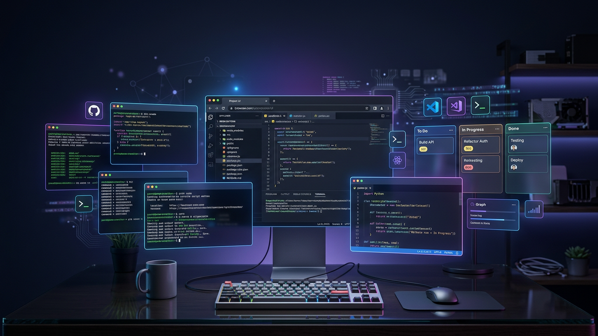
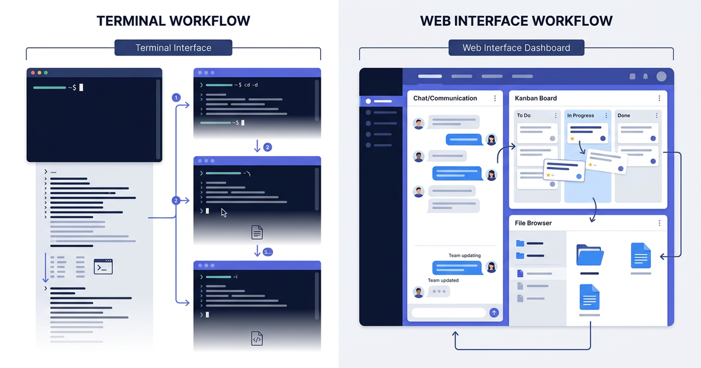

# Claude Code Studio

**The browser interface for Claude Code CLI.** Chat with AI, run tasks automatically, and manage your work — all from one tab, without touching the terminal.

> Available in: [English](README.md) | [Українська](README_UA.md) | [Русский](README_RU.md)

> 📖 [Read on Medium: From Terminal to Dashboard — How Claude Code Studio Changes AI-Assisted Development](https://medium.com/@tiberiy20101/from-terminal-to-dashboard-how-claude-code-studio-changes-ai-assisted-development-749c077469d2)

---

## What is this?

Claude Code CLI is Anthropic's AI that writes code, runs commands, edits files, and ships features — not just talks about them. It's genuinely powerful.

The problem: it lives in your terminal. And the terminal has limits.

**Context gets lost.** Switch projects, and you lose your place. Come back tomorrow and you're scrolling through history to remember where you were.

**Parallel work is painful.** Want Claude working on three things at once? That means three terminal tabs, three sessions, three things to manage manually.

**No visibility.** Queue five tasks and walk away. Two hours later — which ones finished? Which ones failed? You're reading scrollback to find out.

**Screenshots and files are clunky.** "Look at this error" means uploading an image somewhere, getting a URL, pasting it. It works, but it's friction.

Claude Code Studio is the missing interface. You open it in your browser, and your AI starts working.

---

## Terminal vs Web UI



The difference isn't just visual. A web interface changes how you think about delegating work to AI — from one-off prompts to a queue of managed tasks.

---

## What it actually does

### 💬 Chat that does things

Not a chatbot. When you type "refactor this function and add tests", Claude opens files, edits them, runs the tests, fixes errors, and reports back — in real time, right in the chat. Paste a screenshot with Ctrl+V and Claude sees it.

### 📋 Kanban board for your AI tasks

Create a card. Describe what you want. Move it to "To Do". Claude picks it up automatically and starts working.


Queue 10 tasks, walk away, come back to all of them done. Cards can run **in parallel** (independent tasks) or **sequentially** (linked sessions, so Claude remembers what the previous task built).


### ⚡ Slash commands — your personal shortcuts

Type `/` in the chat input and a menu appears with your saved prompts. Pick one, hit Enter.

Instead of typing "Do a thorough code review: readability, performance, security, and adherence to best practices. Point out issues with severity levels" every time — you just type `/review`.

**8 commands ready out of the box:**

| Command | What it does |
|---------|-------------|
| `/check` | Check syntax, logic, edge cases, and bugs step by step |
| `/review` | Full code review with severity levels (critical / warning / suggestion) |
| `/fix` | Find the bug, fix it, explain what changed |
| `/explain` | Explain the code clearly with examples |
| `/refactor` | Clean up the code, keep the same behavior |
| `/test` | Write tests: happy path, edge cases, error scenarios |
| `/docs` | Write documentation with examples and gotchas |
| `/optimize` | Find bottlenecks, propose improvements, estimate gains |

Add your own, edit them, delete them. As many as you want.

### 📱 Telegram Bot — Control Claude from Your Phone

Your laptop is closed. You're at the gym, in a meeting, across the world. But your AI is still working. And now — so are you.

Pair your phone with Claude Code Studio in 30 seconds (6-character code from Settings), and your phone becomes a full remote control:

**Queue & Monitor**
- `/projects` — browse all your sessions
- `/chats` — pick up where you left off
- `/chat` — start a new session right now
- `/tasks` — see your Kanban board. Which tasks are running? Which are done?

**See Results Instantly**
- `/last` — show Claude's last action (code written, tests run, files changed)
- `/full` — get the complete output of the last task
- **Kanban task notifications** — your phone buzzes when each queued task finishes or fails, with the task name, status, and how long it took. No more checking the browser to see if it's done.

**Manage on the Go**
- `/files`, `/cat` — browse project files and peek at code without opening an editor
- `/diff` — see exactly what changed in the last commit
- `/log` — recent git history — who changed what, and when
- `/tunnel` — start or stop Remote Access right from your phone (also available as a button in the main menu)
- `/url` — get the current public URL
- `/new` — start a new task queue
- `/stop` — stop a running task

**Claude Asks — You Answer from Your Phone**
Claude sometimes needs your input mid-task: "Should I refactor this function or rewrite it?" With ask_user forwarding, these questions appear instantly in Telegram as inline buttons. Tap your choice, or type a free-text answer — Claude gets it immediately and keeps working. No need to open the browser. You stay in the loop without breaking your flow.

**Inline Stop — One Tap to Cancel**
Every progress message in Telegram has a built-in [🛑 Stop] button. See Claude going in the wrong direction? Tap it. No commands to type, no menus to navigate — the button is right there, on every "Processing..." update. Combined with [🏠 Menu], you always have full control at your fingertips.

**Send Messages, Get Answers Instantly**
Type a message to Claude directly from Telegram. You see a real-time typing indicator while Claude thinks, and the response streams back to both your phone AND your browser simultaneously. The conversation is unified — continue in Telegram, pick it up on your laptop five minutes later, everything is there. And it works both ways: messages sent from Telegram appear in the web UI in real-time too.

**Multi-Device Pairing**
Pair your phone, your tablet, your laptop — all at once. Control the same Claude Code Studio instance from anywhere. Each device gets push notifications when tasks finish, with inline buttons: [View Result] [Continue] [Menu].

**Why This Matters**

You queue 10 refactoring tasks at 9pm. Instead of staring at your laptop, you go to the gym. At 10:15pm, your phone buzzes: "Task 3 complete". You tap [View] and see the changes. You add a comment: "Next, add error handling for the network case." Claude gets it immediately and starts task 4. Two hours later, everything is done. You tap [View Final] and review the full output in Telegram before you even sit at your desk.

No laptop required. No constant monitoring. Just work, delegated.

### 👥 Multiple agents working at once

For complex tasks, Claude doesn't work alone. It creates a team of specialized agents, assigns subtasks, and coordinates the work. You see all agents working in parallel, each with its own output stream.

### 🌐 Remote servers over SSH

Add a remote server, create a project pointing to a directory on it, and Claude works there — as if local. Useful for GPU machines, staging environments, or managing a server fleet without SSH sessions.

### 🔗 Remote Access — Open Your Studio to the World

Your Studio runs on `localhost:3000`. But what if you need to access it from a coffee shop, your phone's browser, or share a link with a teammate?

One click. That's it. Open the **Remote Access** panel in the sidebar, pick a provider — **cloudflared** (no signup, works instantly) or **ngrok** (if you already use it) — and hit Start. You get a public HTTPS URL in seconds.

- **Zero configuration** — cloudflared needs no account, no token, no DNS setup
- **Secure by default** — your Studio password protects everything, the tunnel is just a pipe
- **Telegram integration** — the URL is sent straight to your paired Telegram devices with one tap
- **Start and stop from your phone** — `/tunnel` and `/url` commands in the Telegram bot
- **Works behind NAT, firewalls, corporate VPNs** — if your machine has internet, it works

Why does this matter? Because your AI doesn't need to be chained to your desk. Start a batch of tasks at home, grab the URL from Telegram, and check results from anywhere.

### 💾 Everything is saved

Sessions, chats, task history — all stored locally in SQLite. Come back tomorrow, continue exactly where you left off.

---

## Who is it for?

**Individual developers** — manage multiple projects, queue tasks, resume sessions days later without losing context.

**Teams** — shared Claude Code Studio instance with project visibility, Kanban showing what's being worked on, session history as an audit trail.

**System administrators** — manage your server fleet from one browser tab. Delegate routine tasks ("check disk usage and clean logs", "update nginx on all 5 servers and verify"). Run operations in parallel across machines.

**ML / AI engineers** — run Claude on powerful remote GPU servers. Queue training jobs and preprocessing tasks. Check results from your laptop.

---

## What it doesn't do

To be clear about the scope:

- It doesn't add capabilities to Claude Code — it provides an interface for them
- It's not a SaaS — you run it locally, your data stays on your machine
- It doesn't replace your IDE — it manages Claude sessions

This isn't a product trying to lock you in. It's infrastructure you can own.

---

## Chat interface


---

## Get started in 60 seconds

You need [Node.js 18+](https://nodejs.org) and the [`claude` CLI](https://docs.anthropic.com/en/claude-code) installed and logged in.

```bash
npx github:Lexus2016/claude-code-studio
```

Open `http://localhost:3000`, set your password on first launch, start chatting.

**To update:**
```bash
npx github:Lexus2016/claude-code-studio@latest
```

---

## Other ways to install

**Install globally** — run `claude-code-studio` from anywhere:
```bash
npm install -g github:Lexus2016/claude-code-studio
```

**Clone the repo** — for developers who want to dig in:
```bash
git clone https://github.com/Lexus2016/claude-code-studio.git
cd claude-code-studio
npm install && node server.js
```

**Docker:**
```bash
git clone https://github.com/Lexus2016/claude-code-studio.git
cd claude-code-studio
cp .env.example .env
docker compose up -d --build
```

---

## Full feature list

| Feature | What it means |
|---------|--------------|
| 💬 Real-time chat | Responses stream in as Claude thinks and works |
| 📋 Kanban board | Queue tasks → Claude runs them automatically |
| ⚡ Slash commands | Saved prompt shortcuts with `/` autocomplete |
| 📱 Telegram bot | Control Claude from your phone — notifications, commands, live session bridge, ask_user forwarding |
| 🔔 Push notifications | Task finished? Get a notification with [View] [Continue] buttons |
| 📡 Session bridge | Send messages from Telegram, responses stream to both phone and browser simultaneously |
| ❓ Ask User in Telegram | Claude's questions forwarded to Telegram — answer with buttons or free text |
| 👥 Multi-agent mode | Claude spawns a team for complex tasks |
| 🔄 Auto-continue | Hits turn limit mid-task? Resumes automatically |
| ↗️ Fork conversation | Continue from any message in a new chat |
| 🔌 MCP servers | Connect GitHub, Slack, databases, and more |
| 🧠 Skills | `.md` files that tell Claude how to work in your domain |
| 📁 File browser | Browse, preview, and attach files with `@filename` |
| 🖼 Vision | Paste screenshots — Claude sees and analyzes them |
| 🗂 Projects | Separate workspaces with their own file directories |
| 🌐 Remote SSH | Work on remote servers as if they were local |
| 🔗 Remote Access | One-click public URL via cloudflared or ngrok — access Studio from anywhere |
| 🔒 File locks | Multiple agents on same codebase — no conflicts |
| 💾 History | Everything saved to SQLite, resume anytime |
| 📊 Rate limit alerts | Warnings at 80/90/95%, live countdown to reset |
| 🔒 Auth | Password login, 30-day tokens, data stays on your machine |
| 🌍 3 languages | English, Ukrainian, Russian (auto-detected) |
| 🐳 Docker | Deploy anywhere |

---

## Technical details

For developers who want to understand or modify how it works.

### Architecture

Single Node.js process. No build step. No TypeScript. No framework.

```
server.js         — Express HTTP + WebSocket
auth.js           — bcrypt passwords, 32-byte session tokens
claude-cli.js     — spawns `claude` subprocess, parses JSON stream
telegram-bot.js   — Telegram bot: remote control, notifications, session bridge
public/index.html — entire frontend (HTML + CSS + JS in one file)
config.json       — MCP server definitions + skills catalog
data/chats.db     — SQLite: sessions + messages
skills/           — .md skill files loaded into system prompt
workspace/        — Claude's working directory
```

### Environment variables

```env
PORT=3000
WORKDIR=./workspace
MAX_TASK_WORKERS=5
CLAUDE_TIMEOUT_MS=1800000
TRUST_PROXY=false
LOG_LEVEL=info
ANTHROPIC_API_KEY=sk-ant-...   # SDK engine only, optional
```

### Two engines

- **CLI engine** — spawns `claude` subprocess. Uses your Claude Max subscription. No API key needed.
- **SDK engine** — calls `@anthropic-ai/claude-code` SDK directly. Requires `ANTHROPIC_API_KEY`.

### Security

- Passwords: bcrypt, 12 rounds
- Tokens: 32-byte random hex, 30-day TTL, server-side storage
- SSH passwords: AES-256-GCM encrypted at rest
- API keys: never sent to the browser
- Headers: Helmet.js on all responses
- File access: path traversal protection on all file operations

### Development

```bash
npm run dev   # auto-reload (node --watch)
npm start     # production
```

---

## License

MIT
