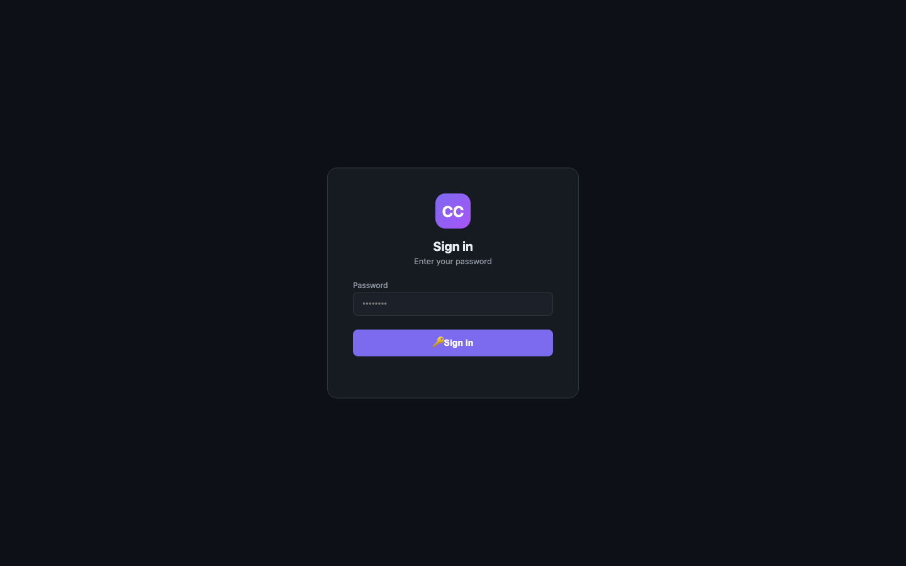
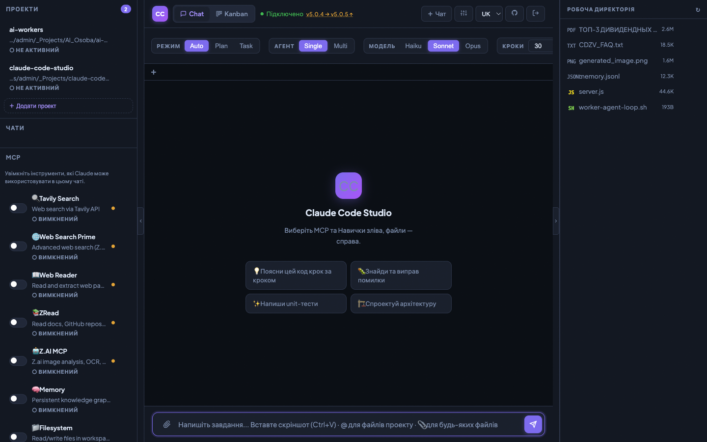
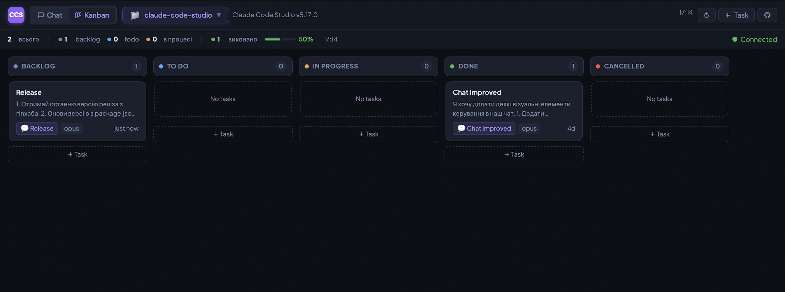

# Claude Code Studio

**Full-featured web workspace for [Claude Code](https://claude.ai/code)** — chat, Kanban task board, multi-agent orchestration, MCP servers, skills, projects — all in one place. No build step required.

> Available in: [English](README.md) | [Українська](README_UA.md) | [Русский](README_RU.md)

---

## Features

| Feature | Description |
|---------|-------------|
| 🖥 CLI Mode | Works via `claude` CLI with Max subscription (no API costs) |
| 💬 Real-time Chat | WebSocket streaming with markdown rendering |
| 👥 Multi-Agent | Orchestrate a team of agents with dependency graph |
| ⚡ MCP Servers | Connect any MCP server — presets + custom |
| 🧠 Skills | Load `.md` skill files into Claude's system prompt |
| 🔄 Modes | Auto / Planning / Task execution modes |
| 💎 Models | Opus 4.6 / Sonnet 4.6 / Haiku 4.5 |
| 📁 File Browser | Browse workspace, preview files, attach via `@mention` |
| 🖼 Vision | Paste images from clipboard, send as vision blocks |
| 📋 History | Persistent sessions in SQLite, resumable |
| ⚙️ Config Editor | Edit `config.json`, `CLAUDE.md`, `.env` in the UI |
| 🔒 Auth | bcrypt password + 30-day session tokens |
| 🐳 Docker | Dockerfile + docker-compose included |
| 🗂 Projects | Named projects with custom workdir, git init, directory browser |
| 🪟 Parallel Tabs | Multiple browser tabs run independently; streaming preserved when switching |
| 📊 Stats Panel | Daily/weekly Claude Max usage, context token estimate |
| 🔐 Multi-instance Safety | File-lock hooks prevent conflicts; workdir-level queue in Kanban |
| 📋 Kanban Board | Drag-and-drop task board at `/kanban` — create tasks, run Claude Code per card |
| 📎 File Attachments | Attach images and text files to Kanban cards — written to workspace for Claude |
| 🔁 Retry Tracking | Auto-retry on crash with retry count badge; no duplicate user messages |
| 🌍 i18n | Interface in English / Ukrainian / Russian (auto-detected) |

---

## Screenshots

### Login Screen
Secure authentication with bcrypt-hashed passwords and 30-day session tokens.



### Chat Interface
Full-featured workspace: real-time WebSocket chat with markdown rendering, MCP server toggles, 20+ skill presets (auto-selected by task), file browser with preview, model & mode selectors — all in a single dark-themed SPA.



### Kanban Board
Drag-and-drop task board with automatic Claude Code execution. Move a card to "To Do" — Claude picks it up, runs the task, and reports back. Retry on crash, per-project filtering, model selection per card.



---

## Installation & Running

### Method 1 — Run instantly with npx (no install)

The easiest way. Downloads and runs the latest release directly:

```bash
npx github:Lexus2016/claude-code-studio
# Open http://localhost:3000
```

Or install globally and run any time:

```bash
npm install -g github:Lexus2016/claude-code-studio
claude-code-chat
# Open http://localhost:3000
```

**How to update:**
```bash
npm install -g github:Lexus2016/claude-code-studio@latest
```

---

### Method 2 — git clone (full control)

**Prerequisites:**
- Node.js 18+
- [`claude` CLI](https://docs.anthropic.com/en/claude-code) installed and authenticated (for CLI mode)

```bash
git clone https://github.com/Lexus2016/claude-code-studio.git
cd claude-code-studio
npm install

cp .env.example .env
# Edit .env as needed

node server.js
# Open http://localhost:3000
# First launch: create a password
```

**How to update:**
```bash
git pull
npm install
node server.js
```

---

### Method 3 — Docker

```bash
git clone https://github.com/Lexus2016/claude-code-studio.git
cd claude-code-studio

cp .env.example .env
# Edit .env as needed

docker compose up -d --build
docker compose logs -f claude-chat
# Open http://localhost:3000
```

**How to update:**
```bash
git pull
docker compose up -d --build
```

---

## Project Structure

```
claude-code-studio/
├── server.js           # Express + WebSocket server (main entry point)
├── auth.js             # bcrypt auth, 30-day token sessions
├── claude-cli.js       # Spawns claude CLI subprocess, parses JSON stream
├── config.json         # MCP server definitions + skills catalog
├── config.example.json # Config template (committed to git)
├── package.json
├── Dockerfile
├── docker-compose.yml
├── .env.example        # Environment variable template
├── bin/
│   └── cli.js          # npx / global install entry point
├── public/
│   ├── index.html      # Single-file SPA (embedded CSS + JS)
│   └── auth.html       # Login / Setup page
├── skills/             # Skill .md files (loaded into system prompt)
├── scripts/
│   └── install-hooks.js  # postinstall: merges Claude Code hooks into .claude/settings.json
├── .claude/
│   ├── settings.json   # Claude Code project hooks config (auto-managed by postinstall)
│   ├── scripts/
│   │   ├── file-lock.sh    # PreToolUse hook: wait for file lock before editing
│   │   └── file-unlock.sh  # PostToolUse hook: release lock after editing
│   └── locks/          # Runtime lock files (gitignored)
├── data/               # Runtime data (gitignored)
│   ├── chats.db        # SQLite database
│   ├── auth.json       # bcrypt password hash
│   ├── sessions-auth.json
│   ├── projects.json   # Saved projects list
│   └── uploads/        # Uploaded files
└── workspace/          # Default Claude Code working directory (gitignored)
```

---

## Configuration

### Environment Variables (`.env`)

```env
PORT=3000
SESSION_SECRET=           # Auto-generated if empty
WORKDIR=./workspace       # Default Claude working directory
TRUST_PROXY=false         # Set true behind nginx/Caddy
LOG_LEVEL=info            # Logging verbosity: error | warn | info | debug
NODE_ENV=production       # Enables structured JSON logging (for Loki, Datadog, etc.)
MAX_TASK_WORKERS=5        # Max parallel Claude Code processes for Kanban tasks
```

### Adding MCP Servers
1. Left panel → ⚡ MCP → "+ Add MCP"
2. Or edit `config.json` directly via ⚙️ Config Editor

### Adding Skills
1. Left panel → 🧠 Skills → "+ Upload .md"
2. Or drop `.md` files in `skills/` and update `config.json`
3. Global skills from `~/.claude/skills/` are also loaded automatically

### Projects
- Left panel → 🗂 Projects → "+ New Project"
- Each project has a name and a working directory (any path on disk)
- Optional `git init` on creation
- Sessions are scoped to a project — history is filtered per project

---

## Architecture

```
Client (browser) ──WS──► server.js ──► claude-cli.js ──► claude (subprocess)
                    HTTP ◄──────────────────────────────────────────────────
```

- Single Node.js process, no build tools
- WebSocket for bidirectional streaming
- SQLite (WAL mode) for sessions and messages
- Multi-agent: orchestrator generates JSON plan → parallel agent execution
- Per-tab parallelism: each browser tab runs its own independent queue

### SQLite Schema

```sql
sessions: id, title, created_at, updated_at, claude_session_id,
          active_mcp, active_skills, mode, agent_mode, model, engine, workdir

messages: id, session_id, role, type, content, tool_name,
          agent_id, reply_to_id, created_at
```

---

## Kanban Board

Navigate to `/kanban` to access the task board.

- **Columns**: Backlog → To Do → In Progress → Done / Cancelled
- **Create tasks**: title, description, notes, linked session, model/mode settings
- **File attachments**: attach images or text files — written to `.kanban-attachments/{taskId}/` in the workspace at task start
- **Run Claude Code**: move a card to "To Do" and it starts automatically; one task per workdir at a time
- **Stop**: drag a running card away from "In Progress" to send SIGTERM to the Claude subprocess
- **Retry**: if Claude crashes, the task auto-restarts with a retry badge (no duplicate messages)
- **Session link**: each card links to its chat session — view history or open in Claude Code terminal

### Sessions in Kanban: Parallel vs Sequential Execution

A **session** in Kanban is the same thing as a **chat** in Chat mode. It holds the full conversation context — everything Claude has already seen and discussed.

When creating a Kanban task, you choose whether to create a **new session** or select an **existing one**. This choice fundamentally changes how Claude executes the task:

| | New Session | Existing Session |
|---|---|---|
| **Context** | Fresh — Claude knows nothing about prior tasks | Shared — Claude remembers all previous tasks in this session |
| **Execution** | **Parallel** — runs independently alongside other tasks | **Sequential** — waits for the previous task in the same session to finish |
| **Best for** | Independent tasks that don't depend on each other | Step-by-step work where each task builds on the previous one |

**Example — Parallel (new sessions):**

You need to add a login page AND redesign the dashboard. These are unrelated tasks, so you create two Kanban cards, each with a **new session**:

```
Card 1: "Add login page"        → New Session (Session #12)
Card 2: "Redesign dashboard"    → New Session (Session #13)
```

Both cards run **at the same time** in separate Claude Code processes. Each Claude instance has its own clean context and doesn't know about the other task. *(Limited by `MAX_TASK_WORKERS` — default 5 parallel processes.)*

**Example — Sequential (same session):**

You want Claude to first create an API, then write tests for it. The second task needs the context of the first. You create two cards linked to the **same session**:

```
Card 1: "Create REST API for /users"     → New Session (Session #14)
Card 2: "Write tests for /users API"     → Existing Session #14
```

Card 1 runs first. When it finishes and moves to "Done", Card 2 starts — **in the same session**. Claude already knows the API structure, file locations, and decisions from Card 1, so it writes tests with full context. This is like continuing a conversation in Chat mode.

> **Tip:** Think of it this way — if you would ask these questions in **one chat conversation** (sequential), link the cards to the same session. If you would open **separate chats** (parallel), create new sessions for each card.

---

## Multi-instance Safety

When you open Claude Code in multiple terminals and work on the same project simultaneously, two instances can accidentally edit the same file at the same time — the last write silently overwrites the other's changes.

This project ships **Claude Code file-lock hooks** that handle this automatically:

- **Before editing** any file — the hook checks if another Claude Code instance is already editing it. If so, it **waits** (polling every 3 seconds) until the file is free, then proceeds.
- **After editing** — the hook immediately releases the lock so the next waiting instance can continue.
- **Stale locks** (e.g. if a Claude session crashed) are detected via PID check and cleared automatically.

```
Claude A (terminal 1)        Claude B (terminal 2)
──────────────────────       ──────────────────────────────
Edit server.js               Edit server.js  ← arrives simultaneously
→ acquires lock              → sees lock, starts waiting...
→ edits file ✓                 ⏳ polling every 3s
→ releases lock              → lock is free! acquires it
                             → edits file ✓
                             → releases lock
```

The hooks are installed automatically on `npm install` via the `postinstall` script. The script **merges** into any existing `.claude/settings.json` — it never overwrites hooks you already have configured. Works on macOS and Linux (including Docker).

---

## Security

- Passwords hashed with bcrypt (12 rounds)
- Auth tokens: 32-byte hex, 30-day TTL, server-side storage
- WebSocket protected by `httpOnly` cookie
- API keys never sent to the frontend
- Helmet.js security headers
- Rate limiting on auth endpoints

---

## Development

```bash
npm run dev    # node --watch server.js (auto-reload)
npm start      # node server.js (production)
```

No linter, no test suite, no build step — vanilla JS frontend, plain Node.js backend.

---

## License

MIT
