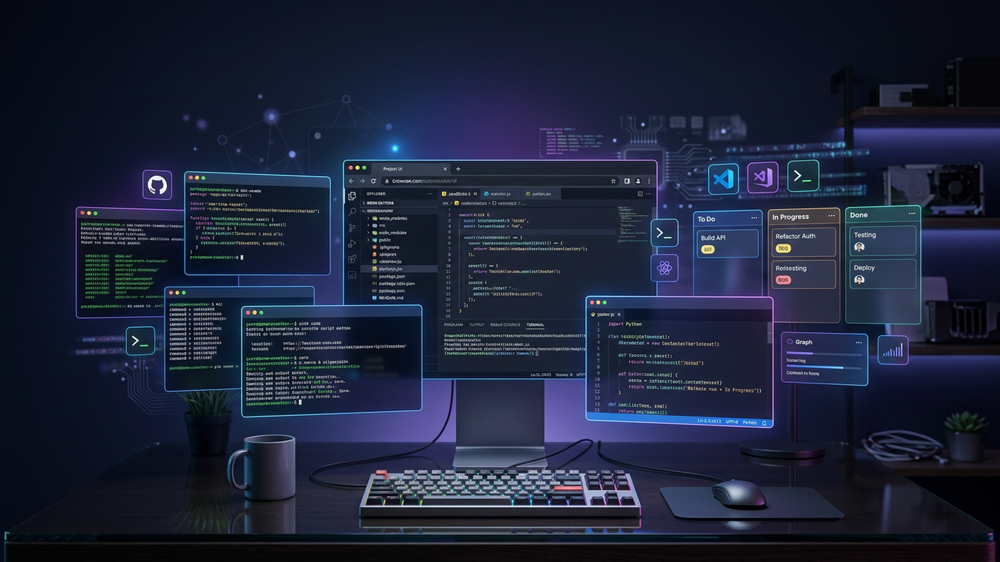
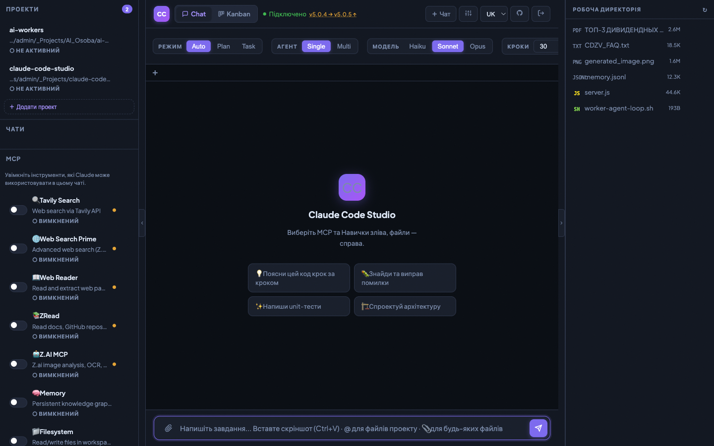
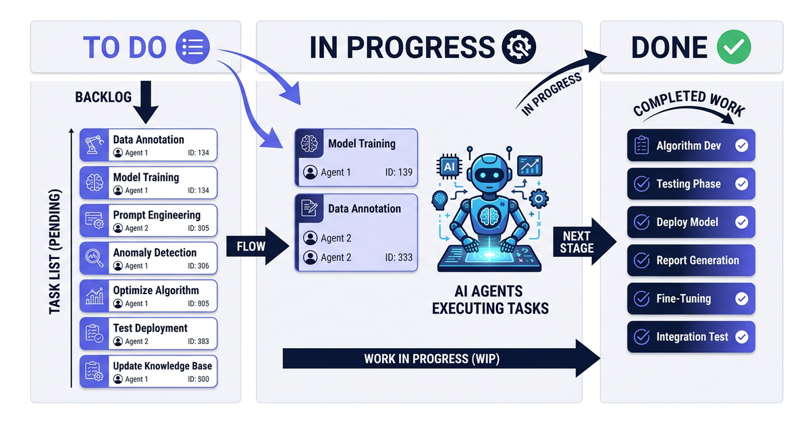
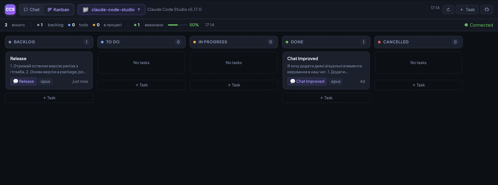
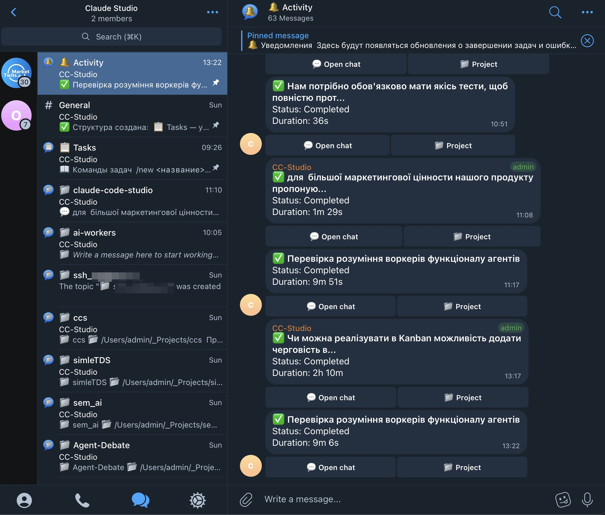
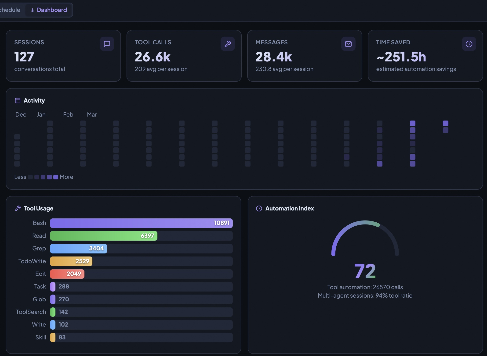

# Claude Code Studio

**The browser interface for Claude Code CLI.** Chat with AI, run tasks on autopilot, and manage your projects — all from one tab.

> [English](README.md) | [Українська](README_UA.md) | [Русский](README_RU.md)

> 📖 [From Terminal to Dashboard](https://www.notion.so/From-Terminal-to-Dashboard-How-Claude-Code-Studio-Changes-AI-Assisted-Development-329676bbc5b6809f9c63e29ca66d8135) | [Remote Access Revolution](https://www.notion.so/Claude-Code-Studio-The-Remote-Access-Revolution-for-AI-Assisted-Development-329676bbc5b68097a5aefac4db29a60d)

> Works on **Windows, macOS, and Linux** — zero platform-specific setup.

> **v7.1.1** — **Bots and terminal agents.** Create named AI specialists with their own prompt, model and memory, and call several in one chat with `@@handle` — in the browser, on Kanban, in the Scheduler and from Telegram. Open any CLI agent as a live terminal tab that survives a restart. Plus a Telegram audit pass: no more lost answers on a deleted topic, broken code blocks in long replies, or duplicated prompts.

---

## Why Claude Code Studio?

Claude Code CLI is powerful — it writes code, runs tests, edits files, and ships features. But it lives in the terminal, and the terminal has limits: context gets lost between sessions, parallel work means juggling tabs, and there's no way to queue tasks and walk away.

Claude Code Studio fixes this:

- **Queue work and walk away** — Kanban board + Scheduler. Claude works while you sleep. Come back to everything done.
- **Control from anywhere** — Telegram bot + Remote Access. Check results from your phone at the gym.
- **Autonomous pipelines** — Tasks create child tasks during execution. One "check issues" task spawns fix tasks automatically.
- **Context never gets lost** — SQLite-backed sessions with self-healing replay. Resume days later, right where you left off.
- **True parallel execution** — Multiple tasks run simultaneously in the same project. No manual tab juggling.

---



---

## 🖥 Desktop App

Prefer a native window over a browser tab? Claude Code Studio also ships as a **desktop app for macOS, Windows and Linux**. It runs the same server locally and renders the full Studio in a native window — chat, Kanban, agents, MCP, skills, everything. The web server is unchanged; the desktop build is simply a second way to launch it.

**Install** (from the [latest release](https://github.com/Lexus2016/claude-code-studio/releases/latest)):

- **macOS** — `brew install --cask Lexus2016/claude-code-studio/claude-code-studio`, or download the `.dmg`
- **Windows** — download the `…-Setup-….exe` installer
- **Linux** — download the `.AppImage` (portable) or `.deb`

**Prerequisite:** same as the web version — the [Claude Code CLI](https://docs.anthropic.com/en/claude-code) installed and logged in. The app detects it on launch and shows an install hint if it's missing.

**Built-in updates:** the app tells you when a new version ships and updates in one click — Windows/Linux update in place, macOS updates via Homebrew. Auto-update is opt-in (default: notify + one click).

**Coming from the CLI/web version?** The desktop app keeps its own data folder, so you can pull your existing history and settings across in one step — no manual file copying:

1. Open the desktop app → menu **File → Import data from CLI / web version…**
2. Pick the folder of your old install — the one that contains `data/` and `config.json`. For the web/server version that's the project folder where you ran `npm start` (the directory with `server.js`).
3. Confirm **Import & Restart**.

It migrates your chat history (`data/chats.db`), projects, SSH hosts and uploads, plus MCP servers and skills (`config.json` + `skills/`). It does **not** copy `.env` or `workspace/` (server-only settings and working files). A timestamped backup of the desktop's current data is made first, then the app restarts automatically.

> Where the desktop keeps its own data — macOS: `~/Library/Application Support/claude-code-studio/` · Windows: `%APPDATA%\claude-code-studio\` · Linux: `~/.config/claude-code-studio/`

**Build from source:**
```bash
npm install
npm run electron:dev     # run the desktop app locally
npm run dist:mac         # build installers — or dist:win / dist:linux
```

> The desktop app is single-user and binds to `127.0.0.1` (no password screen, no network exposure).

---

## 🌐 Web version (run it yourself)

**Prerequisites:** [Node.js 18+](https://nodejs.org) + [Claude Code CLI](https://docs.anthropic.com/en/claude-code) installed and logged in (Claude Pro or Max subscription)

> **Node.js 22.5+** — zero native compilation. Uses built-in `node:sqlite`, no C++ toolchain needed. Older Node.js versions fall back to `better-sqlite3` (requires build tools).

```bash
npx github:Lexus2016/claude-code-studio
```

Open `http://localhost:3000`, set a password, start chatting.

<details>
<summary><b>Other install methods</b></summary>

**Update:**
```bash
npx github:Lexus2016/claude-code-studio@latest
```

**Install globally:**
```bash
npm install -g github:Lexus2016/claude-code-studio
```

**Clone the repo:**
```bash
git clone https://github.com/Lexus2016/claude-code-studio.git
cd claude-code-studio
npm install && node server.js
```

**Docker:**
```bash
git clone https://github.com/Lexus2016/claude-code-studio.git
cd claude-code-studio
cp .env.example .env
docker compose up -d --build

# Enterprise: pull base image from a private registry (Artifactory, Nexus, Harbor)
MIRROR=my-registry.company.com docker compose up -d --build
```

</details>

<details>
<summary><b>Troubleshooting: npm install from GitHub fails</b></summary>

Some npm versions (especially 10.x) fail when installing git dependencies with this error:

```
npm error --prefer-online cannot be provided when using --prefer-offline
```

This is a known npm bug where conflicting flags are passed during git dependency preparation.

**Workaround — install manually:**
```bash
git clone https://github.com/Lexus2016/claude-code-studio.git
cd claude-code-studio
npm install
npm install -g .   # optional: register the `claude-code-studio` CLI command globally
```

**Or update npm:**
```bash
npm install -g npm@latest
```

</details>

---

## Features

### 💬 Real-Time Chat

Not a chatbot. "Refactor this function and add tests" → Claude opens files, edits them, runs tests, fixes errors, reports back — in real time. Paste screenshots with Ctrl+V. When Claude asks a question mid-task, the card collapses into a compact pill after you answer. Hit **Compact & New** to summarize the conversation via Haiku and continue in a fresh session — all context preserved, zero token waste.

**Sidebar quick-filter** — every sidebar section (Projects, Chats, MCP servers, Skills, Commands) has a 🔽 filter button. Click it, type a few letters — the list narrows instantly. Press Esc to clear.

**Claude CLI session import** — import existing sessions from Claude Code CLI (`~/.claude/projects/`) directly into Studio. Click the ↓ button in the header, pick a project path, select sessions, import. Already-imported sessions are marked so you don't duplicate them. Works on Windows (`C:\...`), macOS, and Linux; supports `~` path expansion.

**Extended thinking** — when Claude uses extended thinking, each thinking block appears as a "Chain of thought" badge showing estimated word count. Click to open the full reasoning in a modal with a copy button. The CLI import modal and thinking modal are fully localized (EN/UA/RU/FR/HE) — all labels, status messages, and dates adapt to the selected interface language.

Thinking blocks are now **fully persistent**: switching tabs mid-generation no longer loses the chain of thought — it's saved to SQLite on completion. Live **thinking badges** appear in real time as Claude reasons, so you can watch the thought process unfold. Imported CLI sessions preserve thinking blocks too, so every past reasoning trace is available for review. Session recovery is also correct: thinking blocks are excluded from the context sent back to Claude on resume, so it never sees its own internal reasoning as a prior message. Press **ESC** to close the thinking modal from the keyboard.

Hit **Translate** inside the thinking modal to render the chain of thought in your interface language — powered by Claude haiku, response cached so re-translate is instant. The **Copy** button always copies whatever is currently displayed (original or translated).

**Mid-task interrupt** — send a clarification or new instruction *while Claude is actively working*, without stopping the current task. A compact `⚡ Clarify` pill appears in the input bar while Claude generates — click it to toggle between **Clarify** (inject into the running stream) and **Queue** (schedule after the current task finishes). Delivery is *guaranteed* via a `PreToolUse` hook: Studio intercepts every tool call and delivers your message before Claude's next action. The badge shows delivery status in real time — "Delivered" when Claude reads it, "Task ended" if the task completed before delivery. **Delivery status is now persisted in SQLite** — reload the page, revisit a session days later, and each interrupt in history correctly shows whether it reached Claude or expired. Badge state is reconciled from the server's authoritative count on task completion — correct in every scenario, including multi-tab and missed real-time events. The pill text updates instantly when you switch the UI language — no page refresh needed. The pill is **SSH-aware**: it stays hidden for remote SSH sessions (where the feature isn't applicable) and disappears immediately when switching from a local project to an SSH one — no stale controls left in the input bar.

**Interrupt attachments** — attach files, screenshots, or SSH configs to any mid-task clarification. Claude receives images as visual content (full multimodal MCP blocks), files as readable paths, and SSH configs with credentials pre-filled. No need to stop the task to share context — everything arrives in the same checkpoint delivery. Works from both the web UI and Telegram.

**Rate limit auto-wait** — when Claude's API responds with a rate limit or overload (429), Studio automatically waits for the reset window and retries — no manual refresh, no lost session. A live countdown appears in the chat: *"Rate limited — retrying in 4m 30s"*. Up to 3 automatic retries, max 30-minute wait, correctly handles stale reset timestamps with a safe minimum floor.

**Session notes** — every session has a private scratchpad. Click **📝 Notes** in the session bar to open a resizable textarea that auto-saves as you type. Notes are stored in SQLite alongside the session — your context clues, observations, and reminders persist across restarts and never get sent to Claude.

**In-chat message search** — press **Ctrl+F** (or **⌘F** on Mac) to open a search bar above the messages. Type to instantly filter — only matching messages stay visible. Navigate between hits with ▲▼ or **Enter / Shift+Enter**. Press **Esc** to close. Instantly find that command you ran three hundred messages ago.

**Export as Markdown** — click **📄 MD** in the session bar to download the entire conversation as a clean `.md` file. User messages become `## You` headings, assistant responses become `## Claude` headings. Perfect for pasting into docs, Notion, Obsidian, or dropping into another AI for analysis. Zero setup — one click, instant download.

**`G` key — jump to latest message** — press **`G`** (outside a text field) to instantly snap to the bottom of the chat. Essential in long sessions where you've scrolled up to review context and want to get back without reaching for the mouse.

**Keyboard shortcuts help** — press **`?`** from anywhere outside a text field to open a floating shortcuts reference panel. Every hotkey in the UI — search, send, new line, paste screenshot, close — listed in one place. Dismiss with **Esc** or a click outside. Discoverability without digging through docs.

**Session message counter** — the session bar now shows a live message count ("23 msgs") at a glance. It updates automatically after each generation completes — always reflecting the real depth of the current session. Zero noise when the session is empty.

**`I` key — focus message input** — press **`I`** from anywhere outside a text field to instantly move focus to the message input and place the cursor at the end. No mouse required — your hands never leave the keyboard. Works alongside `G` (jump to bottom) and `?` (shortcuts help) as part of the keyboard-first navigation system.

**Character counter** — a compact live counter appears just left of the Send button whenever your message exceeds 100 characters. Shows the exact character count at a glance — helpful when writing detailed prompts or pasting large blocks of context. Turns amber at 500+ chars and red at 1000+ to signal unusually large inputs at a glance. Disappears automatically once you send or clear the input.

**`T` key — scroll to first message** — press **`T`** (outside a text field) to smoothly scroll to the very top of the chat — the first message in the session. The perfect counterpart to `G` (jump to bottom): use `T` to get back to the beginning of a long conversation, then `G` to return to the present. Keeps `userScrolled` set so auto-scroll doesn't yank you back down.

**`N` key — new chat session** — press **`N`** from anywhere outside a text field to instantly open a fresh chat. The same action as clicking the **＋ Chat** button — without reaching for the mouse. Combined with `G`, `T`, `I`, and `?`, the Studio now has a complete keyboard-first workflow: navigate history, focus input, compose, send, and start fresh — all without a single click.

**Message font size** — press **`=`** to increase and **`-`** to decrease the chat message font size on the fly. Hit **`0`** to snap back to the default 15px. Nine steps from 11px to 22px — find your comfort zone in under a second. The preference is saved to `localStorage` and restored instantly on every page load, so you only set it once.

**Draft auto-save** — every keystroke in the message input is silently persisted to `localStorage`. Refresh the page, close the tab by accident, lose power — your unsent draft comes back exactly as you left it. Drafts are cleared automatically the moment you hit send, so there's no stale recovery noise. Zero setup, zero UI — it just works.

**Session fork** — hit the ↗ button next to any chat to create a full copy that shares the same Claude CLI session history. Branch your conversation at any point — explore alternative approaches without losing the original thread. Works on SSH hosts too.

**Session export / import** — take your chat history anywhere. Export any session as a portable JSON file with one click — full message history, tool calls, timestamps, and attachments included. Import it back into any Studio instance to resume where you left off. The Import button lives on the welcome screen so you can restore a session without having to create one first.

Use cases beyond backup:
- **Transfer between machines** — export on your desktop, import on your laptop or server. Same conversation, different computer.
- **Feed to any AI agent** — drop the exported JSON into ChatGPT, Gemini, or any other AI and say "review what we discussed and let's continue." The format is human-readable and self-contained.
- **Import from any AI** — had a productive session in another tool? Ask it to save the dialog as `{ "session": { "title": "..." }, "messages": [{ "role": "user"|"assistant", "type": "text", "content": "..." }] }` and import the result into Studio. Your conversations aren't locked to one platform.

### 🤝 Bots — Build Your Own Named AI Team

One assistant answering everything is a generalist. **Bots** let you create *named specialists* — each with its own system prompt, its own model, its own conversation memory — and put several of them in the **same chat**, addressed by name.

Create a bot in the sidebar: give it a name, an avatar, a description, pick a model, write its instructions (or start from a built-in template — Analyst, Editor, Reviewer, Explainer). Then just call it:

```
@@analyst @@writer Analyse this quarter's crypto market and produce a PDF report for the traders' club.
```

Both bots work the turn **in order**, and each one sees what the previous one produced — so the analyst digs through the data and the writer turns that analysis into the finished report. No copy-pasting between chats, no re-explaining context.

**Why this beats one big prompt:**

| | One generic assistant | Named bots |
|---|---|---|
| Instructions | One prompt tries to cover everything | Each bot has a focused, short prompt it always follows |
| Model | One model for every job | Cheap model for routine work, strong model where it matters |
| Memory | One thread, everything blurs together | Each bot keeps its own CLI session — its own continuity |
| Review | The same "voice" checks its own work | A reviewer bot with a different brief challenges the result |
| Cost | Big context on every message | Only the bots you actually called run |

**What makes it genuinely useful:**

- **`@@` calls a bot, `@` still attaches a file** — two separate sigils, so a mention is never ambiguous. Unknown handle? You get told, not silence.
- **Per-project availability, global identity** — a bot lives in your library once; you choose which projects it appears in. No philosopher bot cluttering a crypto project.
- **They know about each other** — every bot gets a roster of its teammates, so it can hand work over instead of doing someone else's job badly.
- **Evidence clause built in** — every bot is instructed to state the file, command output, or source behind a factual claim, and to label a guess as a guess.
- **Visible attribution** — in chat, each bot answers in its own bubble with its name, avatar and colour. In Telegram, each answer carries its own header line.
- **Assign a bot to work, not just chat** — pick a bot on a **Kanban** card or a **Scheduler** task, and that bot runs the job on autopilot.
- **Works from your phone** — mention a bot in Telegram and it answers there, correctly attributed.
- **Autocomplete** — type `@@` and pick from the palette; you never have to remember a handle.

A bot that fails mid-turn says so, and its unfinished output is never passed to the next bot as if it were fact.

### >_ Terminal Agents — Any CLI Agent, Live in a Tab

Sometimes you don't want a chat abstraction — you want **the actual agent CLI, running, with its real interface**. Claude Code, Codex, Grok, opencode, Antigravity, Kimi, Cursor Agent — or just a shell.

Open a new tab, choose **Terminal agent**, pick who to launch. A real terminal appears **as a tab in the same workspace**, next to your chat tabs:

- **Full TUI, not a transcript** — the agent's own interface, colours, prompts, keystrokes. Everything works because it *is* the real thing.
- **Tabs, not a takeover** — keep a chat tab and two terminal tabs open and switch between them. Same window, same sidebars, same project.
- **Survives everything** — close the tab, close the browser, restart the server: the session keeps running in `tmux` on the host. Reopen it from history and you're back exactly where you were, scrollback included.
- **Reopened, not restarted** — when a session was reaped to free memory, Studio restores that agent's *specific conversation* by id, not "the most recent one".
- **Idle sessions are reaped** — terminals nobody is watching are shut down after a timeout so they don't sit in RAM; the next time you open one, it comes back.
- **The font slider works here too** — one control resizes chat and terminal alike; the terminal reflows its columns live.
- **Capability-checked, not OS-guessed** — the server probes for `tmux` at boot and disables the button when it isn't there. Works on macOS, Linux, Docker, and Windows via WSL/Git-Bash.

A session is typed **chat** *or* **terminal** at creation and never switches — so two drivers can never fight over one conversation.

### 📋 Kanban Board

Create a card, describe what you want, move to "To Do" — Claude picks it up automatically.



Queue 10 tasks, walk away, come back to all done. Cards run **in parallel** (independent tasks) or **sequentially** (chained sessions — Claude remembers what the previous task built). **Cross-tab sync** updates every open browser tab instantly. True parallel execution — no artificial directory locks for independent tasks.



### 🕐 Scheduler — AI on Autopilot

Create a task, set a time — Claude runs it exactly when needed. No cron, no scripts, no babysitting.

- **One-time:** "Deploy to staging at 6am" — done at 6:00 sharp
- **Recurring:** hourly, daily, weekly, monthly — with optional end date
- **Up to 5 parallel workers** — missed times after restart are skipped gracefully

Recurring tasks are **re-armed in place** — the same task record resets to the next scheduled time after each run, instead of creating a new database row. Task IDs stay stable across recurrences, the database doesn't grow unbounded, and crash recovery correctly re-arms interrupted recurring tasks instead of marking them done.

A **60-second watchdog** scans for tasks stuck in `in_progress` with no live worker — if a worker crashed without cleanup, the watchdog recovers the task automatically (re-arms recurring, resets one-shot to `todo`). The task creation form pre-fills the date/time to **right now** — no blank picker to fill in before scheduling.

Color-coded agenda: overdue (red), today (orange), upcoming (blue), recurring (purple). **Run Now** button for instant testing.

### 🤖 Autonomous Task Manager

During task execution, Claude has access to a built-in MCP server for autonomous task management — turning single tasks into self-directing pipelines.

| Tool | What it does |
|------|-------------|
| `create_task` | Spawn a follow-up task. Found 5 bugs? Create 5 fix tasks automatically |
| `create_chain` | Create sequential pipelines (Build → Test → Deploy) in one call |
| `list_tasks` | Check existing tasks — avoid duplicates, monitor progress |
| `get_current_task` | Read your mission and context from the parent task |
| `report_result` | Store structured results for downstream tasks |
| `get_task_result` | Read output from completed dependency tasks |
| `cancel_task` | Cancel redundant tasks (bug already fixed, duplicate work) |

**Example:** Schedule a nightly "check GitHub issues" task. It reads open issues, creates a fix task for each bug, chains a verification task after each fix, and reports a summary. No human in the loop.

Tasks inherit the project directory. Context is passed explicitly — children know exactly what to do. Chain depth is limited to prevent runaway recursion.

### 📱 Telegram Bot — Control from Your Phone

Pair in 30 seconds (6-digit code from Settings). Your phone becomes a full remote control:

- **Queue & monitor:** `/projects`, `/chats`, `/tasks`, `/chat`, `/new`
- **See results:** `/last`, `/full` — plus push notifications when tasks finish or fail
- **Manage:** `/files`, `/cat`, `/diff`, `/log`, `/stop`, `/tunnel`, `/url`
- **Queue & interrupt while busy:** Send a message while Claude is working — it goes directly into the interrupt queue, not a dead-end "busy" reply. Claude picks it up at the next checkpoint. Attach files too.
- **Ask User forwarding:** Claude's mid-task questions appear as Telegram buttons — tap to answer, or send a file/image as your answer
- **Inline Stop:** 🛑 button on every progress message — one tap to cancel
- **Session bridge:** Messages sync to both phone and browser simultaneously
- **Multi-device:** Pair phone, tablet, laptop — all at once
- **✉ Write button:** Quick-compose shortcut in the persistent keyboard — start typing without navigating menus
- **File attachments:** Send photos/files directly in the bot — get size confirmation, then attach your question

**Forum Mode** — Telegram supergroup with Topics. Each project gets its own thread with deep-link navigation between topics. Rich inline action buttons on every message — fully localized in EN/UA/RU/FR/HE — Continue, Diff, Files, History, New session. Auto-creates project topics on demand. Tasks topic for Kanban management. Activity topic with direct URL buttons to jump into any project.

Forum Mode is now powered by a **dedicated standalone module** (`telegram-bot-forum.js`). Each project topic runs in fully isolated per-thread state — switching between projects in different threads never leaks context or session data. Rock-solid multi-project setup, even across a dozen simultaneous Forum topics. The **Open Chat** button always uses a callback so the bot properly switches session context and shows a live chat preview — not just a raw topic URL jump.



### 👥 Agent Modes

| | Single | Multi | Dispatch |
|---|---|---|---|
| Where | Chat | Chat | Kanban board |
| Agents | 1 | 2–5 parallel | 2–5 as task cards |
| Dependencies | — | Basic | Full DAG |
| Auto-retry | No | No | Yes (with backoff) |
| Survives restart | No | No | Yes (SQLite) |
| Best for | Focused work | Complex tasks to watch | Background batch work |

**Multi** — orchestrator decomposes into 2–5 subtasks with real-time streaming. The planning step uses `--json-schema` structured output — the plan JSON is guaranteed to parse without regex extraction, even with complex prompts. Send plan to Kanban with 📋 button.
**Dispatch** — subtasks go to Kanban as persistent cards with dependency graphs, auto-retry, and cascade cancellation. Effort level set in chat flows to all dispatched tasks automatically.

### ⇗ Cross-Agent Delegation

Send tasks to external AI CLIs — OpenAI Codex, Antigravity CLI, opencode, Aider — directly from the chat interface. Two modes:

| | Handoff | Sync |
|---|---|---|
| Workflow | Fire-and-forget | Parallel collaboration |
| Communication | One-way context transfer | Bi-directional via DIALOG.md |
| Monitoring | Manual check | Auto-polling every 15s + fs.watch |
| Best for | Independent tasks | Tasks requiring back-and-forth |

How it works: click **Delegate** in the session bar, pick an agent and mode, describe the task. Studio generates a `CONTEXT.md` with conversation history and opens a terminal with the external agent. In Sync mode, both agents communicate through a shared `DIALOG.md` — responses appear directly in the main chat with real-time notifications.

**Agents sidebar** — managing external agents is now effortless. A dedicated **Agents** section in the sidebar lets you add, edit, and delete agents without touching `config.json`. Codex, Antigravity CLI, and opencode come **pre-configured out of the box** — seeded automatically on first run. Hit the **Test** button next to any agent to verify connectivity before delegating. Agent IDs auto-generate from the label (with Cyrillic transliteration), and the full UI is localized in EN/UA/RU/FR/HE. Works on **Windows** too — delegation now routes through `cmd.exe` with proper shell escaping. Delegations survive server restarts via persistent state files.

### 🎛 Chat Modes

**Auto** — full tool access (default). **Plan** — read-only analysis; produces an **Execute Plan** button to switch to Auto and run it. Auto Plan Detection switches modes automatically when Claude signals completion. **Task** — explicit execution mode.

### 🧠 Skills & Auto-Skills

28 built-in specialist personas (frontend, security, devops, kubernetes, debugging, code-review...). **Auto mode (⚡)** classifies each message and activates 1–4 relevant skills automatically:

- "Fix this React bug" → `frontend` + `debugging-master`
- "Set up K8s deployment" → `devops` + `kubernetes` + `docker`

Plugin skills auto-discovered from installed Claude Code plugins. Add custom `.md` files to `skills/`.

### ⚡ Slash Commands

Type `/` — pick a saved prompt. 10 built-in:

| `/check` | `/review` | `/fix` | `/explain` |
|-----------|-----------|--------|------------|
| Syntax & bugs | Full code review | Find & fix bug | Explain with examples |
| **`/refactor`** | **`/test`** | **`/docs`** | **`/optimize`** |
| Clean up code | Write tests | Write docs | Find bottlenecks |

Add your own, edit them, delete them. As many as you want.

### ⚙️ Model & Turns

| Model | Context | Best for |
|-------|---------|----------|
| **Haiku** | Standard | Fast — simple questions, quick checks |
| **Sonnet** | **1M tokens** | Balanced (default) — most everyday tasks |
| **Opus** | **1M tokens** | Most capable — complex architecture, hard bugs |
| **Fable** | **1M tokens** | Most creative & reasoning-intensive — complex planning, deep analysis |

Sonnet and Opus run with a **1 million token context window** — entire large codebases, long conversation histories, and massive file sets fit in a single session without hitting limits.

Turn budget: 1–200 (default 50). Auto-continues up to 3x — so 50 turns effectively means up to 200 steps.

**Thinking effort dial** — a new `Effort` dropdown in the chat toolbar (and task/chain forms) lets you tune how hard Claude thinks before responding: `Auto` (CLI default), `Low`, `Med`, `High`, `X-High`, or `Max`. Your selection persists across reloads via localStorage. The effort level flows automatically to every subtask and chain — set it once, runs everywhere.

**Execution engines** — two billing modes, selectable from the chat toolbar:

| Engine | How it runs | Billing |
|--------|-------------|---------|
| **API** | Headless `claude -p` subprocess | Per-token (Claude Pro / API key) |
| **Subscription** | Persistent tmux session (Claude Max) | Claude Max subscription — zero API credits consumed |

The active engine is always visible at a glance: a **⚡ Max** badge appears in the session bar whenever your session runs on the Subscription engine — so you never confuse which billing mode is in effect. Hover any engine button in the toolbar for a full explanation before you switch.

**Global default** — set your preferred engine once with the **★** button next to the toolbar selector (the star lights up when the current selection is your default). Every new chat — and every new **Kanban** card and **Scheduler** task — starts on it, while any individual chat or task can still override per-item. The engine selector lives in Chat, the Kanban task form, and the Scheduler form alike, and falls back to **API** automatically when `tmux` is unavailable (e.g. native Windows without WSL) — the Subscription option is disabled with a clear hint rather than failing only after you send.

### 🌐 Remote Access & SSH

**SSH** — add remote servers, create projects pointing to directories on them. Claude works there as if local. Type `#` in chat for quick multi-server attachment. Screenshots and files auto-upload via SFTP.

**Remote Access** — one click: cloudflared (no signup) or ngrok. Public HTTPS URL in seconds. Works behind NAT, firewalls, corporate VPNs. URL sent to Telegram automatically.

### 📊 Dashboard



Activity heatmap (90 days), tool usage breakdown, model distribution, Automation Index (0–100), peak hours, top sessions with one-click navigation. Every number links to real data.

### 📱 Mobile-Ready

Open the URL on your phone — native-feel interface. Mobile header with live status indicator, bottom sheet settings, scroll-snap Kanban columns, touch-optimized 44px targets, iOS-safe. Not a "mobile version" — the real interface, redesigned for touch.

---

## Who is it for?

**Developers** — Multiple projects, task queues, session continuity. Schedule nightly tests. Let Claude work the night shift.

**Teams** — Shared instance with project visibility, Kanban audit trail, recurring Monday code reviews.

**Sysadmins** — Server fleet management from one tab. Scheduled health checks, security scans, multi-server operations with Telegram alerts.

**ML/AI Engineers** — Remote GPU servers via SSH. Queued training jobs. Scheduled data pipelines. Phone monitoring via Telegram.

---

## What this is (and isn't)

- **Not a SaaS** — runs on your machine. No account, no telemetry, no vendor lock-in.
- **Not an IDE** — manages Claude sessions. Keep using VS Code, Cursor, or whatever you prefer.
- **Not a fork** — wraps the official CLI. Anthropic updates flow through automatically.

MIT licensed. Your infrastructure, your data.

---

## Using OpenRouter Models

Use **[Claude Flow](https://github.com/Lexus2016/claude-flow)** to route through [OpenRouter](https://openrouter.ai) — GPT-4o, Gemini, Llama, Mistral, and more:

```bash
npx github:Lexus2016/claude-flow          # one-time setup
npx github:Lexus2016/claude-code-studio    # launch as usual
```

---

## Feature Reference

| Category | Features |
|----------|----------|
| **Chat** | Real-time streaming, screenshot paste, file attach (`@file`), conversation fork, auto-continue (3x), session compact, sidebar quick-filter, CLI session import, terminal catch-up (import a `claude --resume` conversation into the web chat), extended thinking display, session export/import (JSON + Markdown), mid-task interrupt (PreToolUse + Stop hooks + attachments), session fork, rate limit auto-wait, effort dial, session name in `/resume` picker, session notes, in-chat search (Ctrl+F / ⌘F), ⚡ Max badge, keyboard shortcuts help (`?`), session message counter, `G` jump-to-bottom, `I` focus input, character counter, `T` scroll-to-top, `N` new session, font size adjust (`=`/`-`/`0`), draft auto-save |
| **Bots** | Named AI specialists with own prompt/model/memory, several per chat via `@@handle`, sequential turns with context hand-off, `@@` autocomplete palette, built-in templates (Analyst / Editor / Reviewer / Explainer), per-project availability with a global library, teammate roster, evidence clause, per-bot chat bubbles with name + avatar + colour, assignable to Kanban cards and Scheduler tasks, works from Telegram with per-bot headers |
| **Terminal agents** | Any CLI agent live in a workspace tab (Claude Code, Codex, Grok, opencode, Antigravity, Kimi, Cursor Agent, shell), full TUI over tmux control mode, several tabs side by side with chat, survives browser/server restart, exact conversation restore by id, idle reaping with revive on reopen, shared font-size control, capability-checked (tmux) on macOS/Linux/Docker/WSL |
| **Engines** | API (headless `claude -p`, per-token billing) + Subscription (Claude Max tmux, no API credits), engine tooltips, ⚡ Max badge, global default (★ set-as-default for new chats/tasks), per-item override, available in Chat + Kanban + Scheduler, tmux-aware (auto-disabled without tmux), Opus / Sonnet / Haiku model selector |
| **Kanban** | Task queue, parallel + sequential, cross-tab sync, drag-and-drop tabs, dependency graphs, engine + model + effort per task/chain |
| **Scheduler** | One-time + recurring (hourly/daily/weekly/monthly), 5 parallel workers, Run Now, SQLite-persisted, engine + model + effort per task, watchdog auto-recovery |
| **Task Manager** | Autonomous child tasks, chains, context passing, result reporting, cancellation (MCP) |
| **Telegram** | Bot control, push notifications, ask_user forwarding (+ file answers), session bridge, Forum Mode, inline stop, deep-link navigation, rich action buttons (localized EN/UA/RU/FR/HE), Write button, file attachments, interrupt queue while busy |
| **Delegation** | Cross-agent handoff/sync (Codex, Antigravity, opencode), CONTEXT.md + DIALOG.md protocol, fs.watch + polling, persistent across restarts, Windows support, sidebar agents manager, auto-seeded defaults, test button |
| **Agents** | Single, Multi (2–5 in-chat, schema-validated planning), Dispatch (Kanban), auto-retry, cascade cancellation, effort propagation |
| **Modes** | Auto, Plan (read-only + Execute Plan), Task, auto mode switching |
| **Skills** | 28 built-in, auto-classification, plugin discovery, custom `.md` files |
| **Commands** | 10 built-in slash commands, custom commands |
| **Remote** | SSH servers, SFTP upload, `#` quick-attach, cloudflared/ngrok tunnels |
| **Mobile** | Native-feel UI, bottom sheet, scroll-snap Kanban, iOS-safe, touch-optimized |
| **Dashboard** | Activity heatmap, tool usage, model distribution, Automation Index, peak hours |
| **Reliability** | security-hardened Telegram uploads, self-healing sessions, crash protection, atomic writes, instant stop, rate limit auto-wait, concurrency safety (session lock + busy_timeout), orphaned session lock auto-cleanup |
| **Security** | bcrypt auth, AES-256-GCM SSH, Helmet.js, path traversal protection, XSS/SQLi prevention |
| **Platform** | Windows/macOS/Linux, Docker (non-root, registry mirror), LLM proxy/gateway, 5 languages (EN/UA/RU/FR/HE), OpenRouter support |

---

## Technical Details

**Architecture** — Single Node.js process. No build step. No TypeScript. No framework.

```
server.js              — Express HTTP + WebSocket
auth.js                — bcrypt passwords, 32-byte session tokens
claude-cli.js          — spawns `claude` subprocess, parses JSON stream
telegram-bot.js        — Telegram bot (Direct Mode)
telegram-bot-forum.js  — Forum Mode standalone module (composition pattern)
mcp-task-manager.js    — MCP server for autonomous task management
mcp-notify.js          — MCP server for non-blocking notifications
public/index.html      — entire frontend (HTML + CSS + JS)
config.json            — MCP servers + skills catalog
data/chats.db          — SQLite (WAL mode)
skills/                — .md skill files → system prompt
```

**Environment:**

```env
PORT=3000
WORKDIR=./workspace
MAX_TASK_WORKERS=5
CLAUDE_IDLE_TIMEOUT_MS=600000   # kill subprocess after this idle gap (no output); default 10 min (legacy alias: CLAUDE_TIMEOUT_MS)
CLAUDE_HARD_CAP_MS=0            # optional absolute timeout ceiling; 0 = disabled (default)
TASK_DISCONNECT_TIMEOUT_MS=1800000  # abort a task this long after the browser tab detaches; 0 = never
MULTI_AGENT_MAX_TURNS_CAP=200   # ceiling on turns per sub-agent; each may auto-continue 3x
TRUST_PROXY=false
LOG_LEVEL=info
ANTHROPIC_BASE_URL=       # LLM proxy/gateway (LiteLLM, Bifrost, OpenRouter)
```

**Security:** bcrypt (12 rounds), 32-byte tokens (30-day TTL), AES-256-GCM for SSH passwords, Helmet.js headers, path traversal protection, XSS filtering, parameterized SQL queries, 2MB buffer caps.

**Development:**

```bash
npm run dev   # auto-reload (node --watch)
npm start     # production
```

---

## License

MIT

## Star History

<a href="https://www.star-history.com/?repos=Lexus2016%2Fclaude-code-studio&type=date&legend=top-left">
 <picture>
   <source media="(prefers-color-scheme: dark)" srcset="https://api.star-history.com/chart?repos=Lexus2016/claude-code-studio&type=date&theme=dark&legend=top-left" />
   <source media="(prefers-color-scheme: light)" srcset="https://api.star-history.com/chart?repos=Lexus2016/claude-code-studio&type=date&legend=top-left" />
   
 </picture>
</a>
