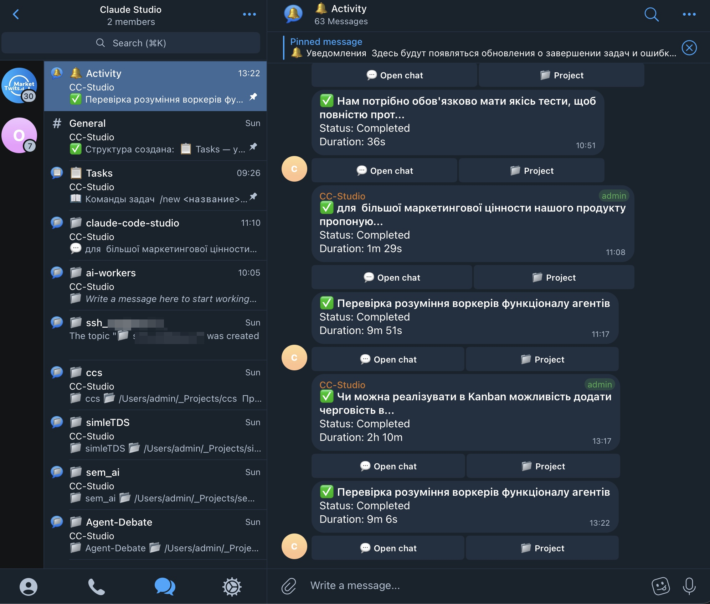
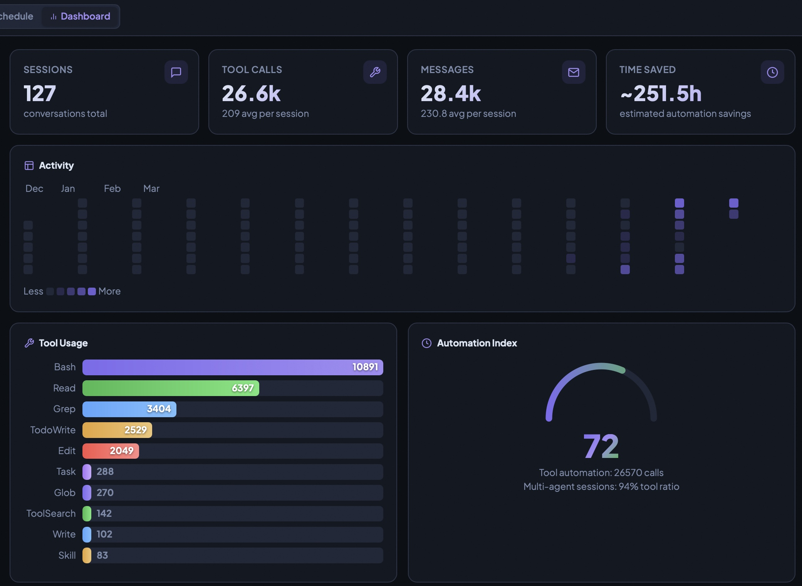

# Claude Code Studio

**Браузерний інтерфейс для Claude Code CLI.** Спілкуйтесь з AI, виконуйте завдання на автопілоті та керуйте проектами — все в одній вкладці.

> [English](README.md) | [Українська](README_UA.md) | [Русский](README_RU.md)

> 📖 [Від термінала до Dashboard](https://www.notion.so/From-Terminal-to-Dashboard-How-Claude-Code-Studio-Changes-AI-Assisted-Development-329676bbc5b6809f9c63e29ca66d8135) | [Революція віддаленого доступу](https://www.notion.so/Claude-Code-Studio-The-Remote-Access-Revolution-for-AI-Assisted-Development-329676bbc5b68097a5aefac4db29a60d)

> Працює на **Windows, macOS та Linux** — без специфічного налаштування під платформу.

---

## Навіщо Claude Code Studio?

Claude Code CLI — потужний інструмент: пише код, запускає тести, редагує файли та впроваджує функції. Але він живе в терміналі, а термінал має обмеження: контекст губиться між сесіями, паралельна робота перетворюється на жонглювання вкладками, і немає можливості поставити завдання в чергу та відійти.

Claude Code Studio вирішує це:

- **Поставте завдання в чергу та йдіть** — Kanban-дошка + Scheduler. Claude працює, поки ви спите. Повертайтесь до готового результату.
- **Керуйте звідусіль** — Telegram-бот + Remote Access. Перевіряйте результати з телефону в спортзалі.
- **Автономні пайплайни** — завдання створюють дочірні завдання під час виконання. Одне завдання "перевір issues" автоматично породжує завдання на виправлення.
- **Контекст не губиться** — сесії на SQLite з механізмом самовідновлення. Продовжуйте через кілька днів точно з того місця, де зупинились.
- **Справжнє паралельне виконання** — декілька завдань запускаються одночасно в одному проекті. Ніякого ручного перемикання вкладок.

---

## Запуск за 60 секунд

**Вимоги:** [Node.js 18+](https://nodejs.org) + [Claude Code CLI](https://docs.anthropic.com/en/claude-code) встановлено та авторизовано (підписка Claude Pro або Max)

> **Node.js 22.5+** — нуль нативної компіляції. Використовує вбудований `node:sqlite`, не потрібен C++ тулчейн. Старіші версії Node.js використовують `better-sqlite3` (потребує build tools).

```bash
npx github:Lexus2016/claude-code-studio
```

Відкрийте `http://localhost:3000`, задайте пароль, починайте спілкування.

<details>
<summary><b>Інші способи встановлення</b></summary>

**Оновлення:**
```bash
npx github:Lexus2016/claude-code-studio@latest
```

**Встановити глобально:**
```bash
npm install -g github:Lexus2016/claude-code-studio
```

**Клонувати репозиторій:**
```bash
git clone https://github.com/Lexus2016/claude-code-studio.git
cd claude-code-studio
npm install && node server.js
```

**Docker:**
```bash
git clone https://github.com/Lexus2016/claude-code-studio.git
cd claude-code-studio
cp .env.example .env
docker compose up -d --build

# Enterprise: базовий образ з приватного реєстру (Artifactory, Nexus, Harbor)
MIRROR=my-registry.company.com docker compose up -d --build
```

</details>

---


---

## Можливості

### 💬 Чат у реальному часі

Це не чат-бот. "Відрефактори цю функцію та додай тести" → Claude відкриває файли, редагує їх, запускає тести, виправляє помилки, звітує — у реальному часі. Вставляйте скріншоти через Ctrl+V. Коли Claude ставить питання посеред завдання, картка згортається в компактну пігулку після вашої відповіді. Натисніть **Compact & New** — розмова стискується через Haiku і продовжується в новій сесії зі збереженим контекстом, без витрат токенів.

**Швидкий фільтр бічної панелі** — у кожній секції (Проекти, Чати, MCP-сервери, Skills, Команди) є кнопка 🔽. Натисніть, введіть кілька літер — список звужується миттєво. Esc для очищення.

### 📋 Kanban-дошка

Створіть картку, опишіть що потрібно, перемістіть у "To Do" — Claude підхопить автоматично.


Поставте 10 завдань у чергу, відійдіть, поверніться до готового результату. Картки виконуються **паралельно** (незалежні завдання) або **послідовно** (зв'язані сесії — Claude пам'ятає, що побудувало попереднє завдання). **Синхронізація між вкладками** миттєво оновлює кожну відкриту вкладку браузера. Справжнє паралельне виконання — без штучних блокувань директорій для незалежних завдань.


### 🕐 Scheduler — AI на автопілоті

Створіть завдання, вкажіть час — Claude виконає його точно тоді, коли потрібно. Без cron, без скриптів, без нагляду.

- **Одноразово:** "Задеплой на staging о 6 ранку" — виконано рівно о 6:00
- **Повторювані:** щогодини, щодня, щотижня, щомісяця — з опційною кінцевою датою
- **До 5 паралельних воркерів** — пропущені запуски після перезапуску пропускаються коректно

Кольорове розмаєття: прострочені (червоний), сьогодні (помаранчевий), майбутні (синій), повторювані (фіолетовий). Кнопка **Run Now** для миттєвого тестування.

### 🤖 Автономний менеджер завдань

Під час виконання завдань Claude має доступ до вбудованого MCP-сервера для автономного керування завданнями — перетворюючи одиночні завдання на самоспрямовані пайплайни.

| Інструмент | Що робить |
|------|-------------|
| `create_task` | Породити наступне завдання. Знайшов 5 багів? Автоматично створить 5 завдань на виправлення |
| `create_chain` | Створити послідовний пайплайн (Build → Test → Deploy) за один виклик |
| `list_tasks` | Перевірити наявні завдання — уникати дублікатів, моніторити прогрес |
| `get_current_task` | Прочитати місію та контекст з батьківського завдання |
| `report_result` | Зберегти структуровані результати для наступних завдань |
| `get_task_result` | Прочитати вивід з виконаних залежних завдань |
| `cancel_task` | Скасувати надлишкові завдання (баг вже виправлено, дублювання роботи) |

**Приклад:** Заплануйте нічне завдання "перевір GitHub issues". Воно читає відкриті issues, створює завдання на виправлення для кожного бага, прив'язує завдання верифікації після кожного виправлення та формує зведений звіт. Без участі людини.

Завдання успадковують директорію проекту. Контекст передається явно — дочірні завдання знають точно, що робити. Глибина ланцюжка обмежена для запобігання безконтрольній рекурсії.

### 📱 Telegram-бот — керування з телефону

Підключення за 30 секунд (6-значний код з налаштувань). Ваш телефон стає повноцінним пультом керування:

- **Черга та моніторинг:** `/projects`, `/chats`, `/tasks`, `/chat`, `/new`
- **Перегляд результатів:** `/last`, `/full` — плюс push-сповіщення при завершенні або помилці завдань
- **Керування:** `/files`, `/cat`, `/diff`, `/log`, `/stop`, `/tunnel`, `/url`
- **Переадресація Ask User:** питання Claude посеред завдань з'являються як кнопки Telegram — торкніться для відповіді
- **Inline Stop:** кнопка 🛑 в кожному повідомленні прогресу — одне торкання для скасування
- **Міст сесій:** повідомлення синхронізуються одночасно в телефон і браузер
- **Мультипристрій:** підключіть телефон, планшет, ноутбук — все одночасно
- **✉ Кнопка «Написати»:** швидкий доступ у постійній клавіатурі — починайте друкувати без навігації по меню
- **Вкладення файлів:** надсилайте фото/файли прямо в бот — отримуйте підтвердження з розміром, потім додавайте питання

**Forum Mode** — Telegram-супергрупа з темами. Кожен проект отримує власний тред із deep-link навігацією між топіками. Багаті inline-кнопки дій на кожному повідомленні — повністю локалізовані (EN/UA/RU) — Continue, Diff, Files, History, New session. Автоматичне створення проектних топіків. Тема Tasks для керування Kanban. Тема Activity з прямими URL-кнопками для переходу в будь-який проект.



### 👥 Режими агентів

| | Single | Multi | Dispatch |
|---|---|---|---|
| Де | Чат | Чат | Kanban-дошка |
| Агентів | 1 | 2–5 паралельно | 2–5 як картки завдань |
| Залежності | — | Базові | Повний DAG |
| Авто-повтор | Ні | Ні | Так (з backoff) |
| Виживає після перезапуску | Ні | Ні | Так (SQLite) |
| Найкраще для | Зосередженої роботи | Складних завдань для спостереження | Фонової пакетної роботи |

**Multi** — оркестратор декомпозує на 2–5 підзавдань з потоковою передачею в реальному часі. Відправте план до Kanban кнопкою 📋.
**Dispatch** — підзавдання потрапляють до Kanban як постійні картки з графами залежностей, авто-повтором і каскадним скасуванням.

### 🎛 Режими чату

**Auto** — повний доступ до інструментів (за замовчуванням). **Plan** — аналіз тільки для читання; генерує кнопку **Execute Plan** для переходу до Auto та виконання. Автоматичне визначення плану перемикає режими автоматично, коли Claude сигналізує про завершення. **Task** — явний режим виконання.

### 🧠 Skills та Auto-Skills

28 вбудованих спеціалізованих персон (frontend, security, devops, kubernetes, debugging, code-review...). **Auto-режим (⚡)** класифікує кожне повідомлення та автоматично активує 1–4 релевантних skills:

- "Виправ цей React-баг" → `frontend` + `debugging-master`
- "Налаштуй K8s deployment" → `devops` + `kubernetes` + `docker`

Plugin skills автоматично виявляються зі встановлених плагінів Claude Code. Додавайте власні `.md` файли до `skills/`.

### ⚡ Slash-команди

Введіть `/` — виберіть збережений промпт. 8 вбудованих:

| `/check` | `/review` | `/fix` | `/explain` |
|-----------|-----------|--------|------------|
| Синтаксис і баги | Повний code review | Знайти і виправити баг | Пояснити на прикладах |
| **`/refactor`** | **`/test`** | **`/docs`** | **`/optimize`** |
| Прибрати код | Написати тести | Написати документацію | Знайти вузькі місця |

Додавайте власні, редагуйте, видаляйте. Скільки завгодно.

### ⚙️ Модель та кроки

| Модель | Найкраще для |
|-------|----------|
| **Haiku** | Швидкий — прості питання, швидкі перевірки |
| **Sonnet** | Збалансований (за замовчуванням) — більшість повсякденних завдань |
| **Opus** | Найпотужніший — складна архітектура, складні баги |

Бюджет кроків: 1–200 (за замовчуванням 50). Автопродовження до 3x — тобто 50 кроків фактично означає до 200 дій.

### 🌐 Remote Access та SSH

**SSH** — додавайте віддалені сервери, створюйте проекти що вказують на директорії на них. Claude працює там, ніби локально. Введіть `#` у чаті для швидкого підключення до кількох серверів. Скріншоти та файли автоматично завантажуються через SFTP.

**Remote Access** — один клік: cloudflared (без реєстрації) або ngrok. Публічна HTTPS-URL за секунди. Працює за NAT, файрволами, корпоративними VPN. URL автоматично надсилається в Telegram.

### 📊 Dashboard



Теплова карта активності (90 днів), розбивка використання інструментів, розподіл за моделями, Automation Index (0–100), пікові години, топ-сесії з навігацією в один клік. Кожна цифра посилається на реальні дані.

### 📱 Мобільний інтерфейс

Відкрийте URL на телефоні — інтерфейс з відчуттям нативного додатку. Мобільна шапка з індикатором статусу в реальному часі, налаштування у bottom sheet, Kanban-колонки зі scroll-snap, оптимізовані для дотику цілі 44px, безпечний для iOS. Не "мобільна версія" — справжній інтерфейс, переосмислений для дотику.

---

## Для кого це?

**Розробники** — декілька проектів, черги завдань, безперервність сесій. Плануйте нічні тести. Нехай Claude працює в нічну зміну.

**Команди** — спільний екземпляр з видимістю проектів, аудитовий слід Kanban, регулярні понеділкові code review.

**Системні адміністратори** — керування флотом серверів з однієї вкладки. Заплановані перевірки здоров'я, сканування безпеки, операції на кількох серверах зі сповіщеннями в Telegram.

**ML/AI-інженери** — віддалені GPU-сервери через SSH. Черга навчальних задач. Заплановані дата-пайплайни. Моніторинг з телефону через Telegram.

---

## Що це (і чим не є)

- **Не SaaS** — працює на вашій машині. Без облікового запису, без телеметрії, без прив'язки до постачальника.
- **Не IDE** — керує сесіями Claude. Продовжуйте використовувати VS Code, Cursor або що завгодно.
- **Не форк** — обгортає офіційний CLI. Оновлення від Anthropic проходять автоматично.

Ліцензія MIT. Ваша інфраструктура, ваші дані.

---

## Використання моделей OpenRouter

Використовуйте **[Claude Flow](https://github.com/Lexus2016/claude-flow)** для маршрутизації через [OpenRouter](https://openrouter.ai) — GPT-4o, Gemini, Llama, Mistral та інші:

```bash
npx github:Lexus2016/claude-flow          # одноразове налаштування
npx github:Lexus2016/claude-code-studio    # запуск як зазвичай
```

---

## Довідник можливостей

| Категорія | Можливості |
|----------|----------|
| **Чат** | Потокова передача в реальному часі, вставка скріншотів, прикріплення файлів (`@file`), форк розмови, авто-продовження (3x), стиснення сесій, швидкий фільтр бічної панелі |
| **Kanban** | Черга завдань, паралельно + послідовно, синхронізація між вкладками, drag-and-drop вкладки, графи залежностей |
| **Scheduler** | Одноразово + повторювані (щогодини/щодня/щотижня/щомісяця), 5 паралельних воркерів, Run Now, збереження в SQLite |
| **Task Manager** | Автономні дочірні завдання, ланцюжки, передача контексту, звітування про результати, скасування (MCP) |
| **Telegram** | Керування ботом, push-сповіщення, переадресація ask_user, міст сесій, Forum Mode, inline stop, deep-link навігація, rich action buttons (EN/UA/RU), кнопка «Написати», вкладення файлів |
| **Агенти** | Single, Multi (2–5 у чаті), Dispatch (Kanban), авто-повтор, каскадне скасування |
| **Режими** | Auto, Plan (тільки читання + Execute Plan), Task, автоматичне перемикання режимів |
| **Skills** | 28 вбудованих, авто-класифікація, виявлення плагінів, власні `.md` файли |
| **Команди** | 8 вбудованих slash-команд, власні команди |
| **Віддалений доступ** | SSH-сервери, SFTP завантаження, швидке підключення `#`, тунелі cloudflared/ngrok |
| **Мобільний** | Нативний UI, bottom sheet, Kanban зі scroll-snap, безпечний для iOS, оптимізований для дотику |
| **Dashboard** | Теплова карта активності, використання інструментів, розподіл моделей, Automation Index, пікові години |
| **Надійність** | Сесії з самовідновленням, захист від збоїв, атомарні записи, миттєва зупинка |
| **Безпека** | bcrypt-авторизація, AES-256-GCM SSH, Helmet.js, захист від path traversal, запобігання XSS/SQLi |
| **Платформа** | Windows/macOS/Linux, Docker (non-root, registry mirror), LLM proxy/gateway, 3 мови (EN/UA/RU), підтримка OpenRouter |

---

## Технічні деталі

**Архітектура** — один Node.js-процес. Без кроку збірки. Без TypeScript. Без фреймворку.

```
server.js              — Express HTTP + WebSocket
auth.js                — bcrypt passwords, 32-byte session tokens
claude-cli.js          — spawns `claude` subprocess, parses JSON stream
telegram-bot.js        — Telegram bot + Forum Mode
mcp-task-manager.js    — MCP server for autonomous task management
mcp-notify.js          — MCP server for non-blocking notifications
public/index.html      — entire frontend (HTML + CSS + JS)
config.json            — MCP servers + skills catalog
data/chats.db          — SQLite (WAL mode)
skills/                — .md skill files → system prompt
```

**Середовище:**

```env
PORT=3000
WORKDIR=./workspace
MAX_TASK_WORKERS=5
CLAUDE_TIMEOUT_MS=1800000
TRUST_PROXY=false
LOG_LEVEL=info
ANTHROPIC_BASE_URL=       # LLM proxy/gateway (LiteLLM, Bifrost, OpenRouter)
```

**Безпека:** bcrypt (12 rounds), 32-байтні токени (TTL 30 днів), AES-256-GCM для SSH-паролів, заголовки Helmet.js, захист від path traversal, фільтрація XSS, параметризовані SQL-запити, обмеження буфера 2MB.

**Розробка:**

```bash
npm run dev   # авто-перезавантаження (node --watch)
npm start     # продакшн
```

---

## Ліцензія

MIT
