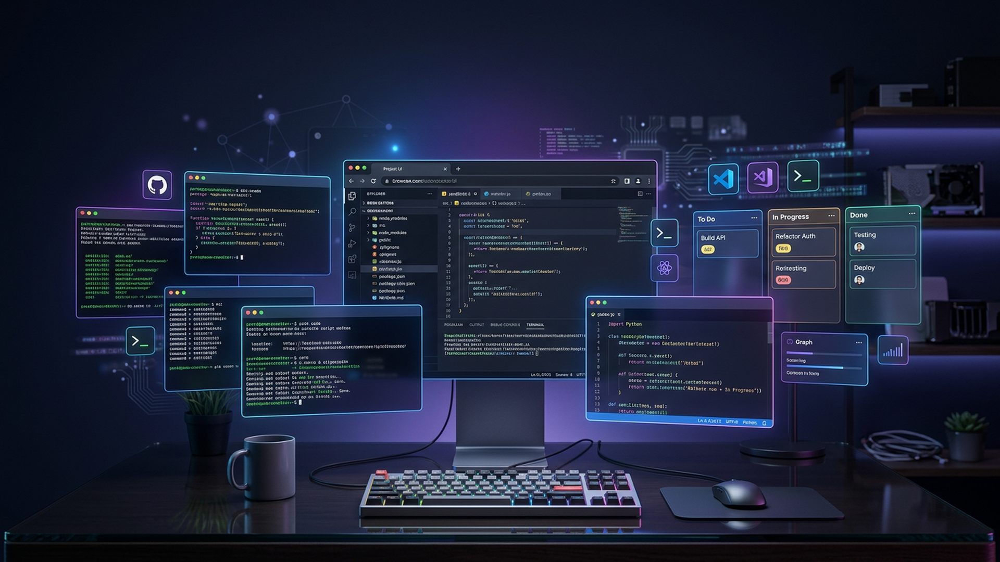
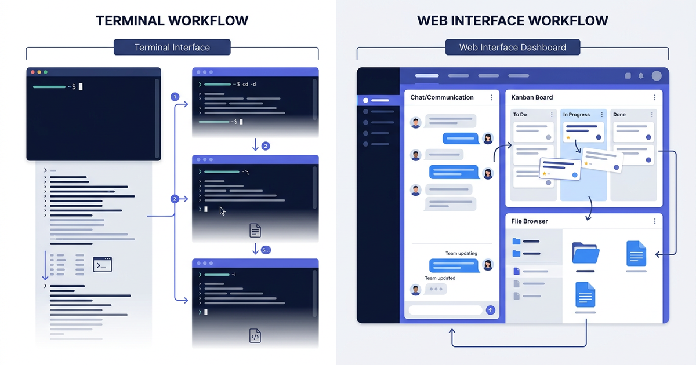
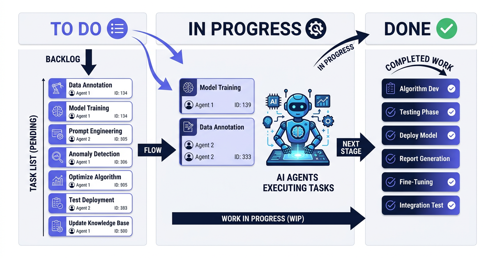
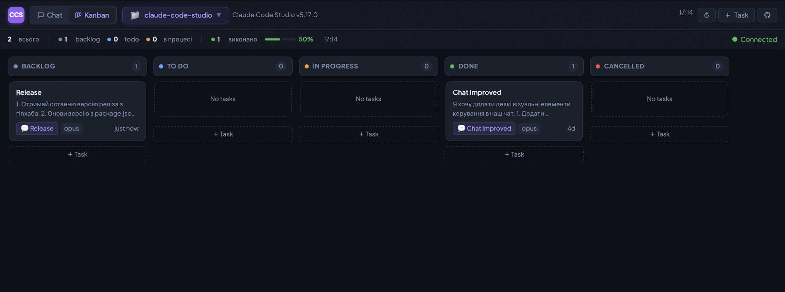
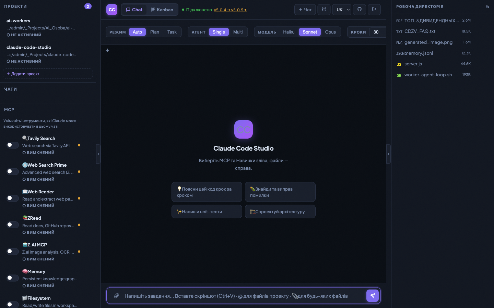

# Claude Code Studio

**Браузерний інтерфейс для Claude Code CLI.** Спілкуйтесь з AI, запускайте задачі автоматично і керуйте роботою — все в одній вкладці, без терміналу.

> Мови: [English](README.md) | [Українська](README_UA.md) | [Русский](README_RU.md)

> 📖 [Читати на Medium: From Terminal to Dashboard — How Claude Code Studio Changes AI-Assisted Development](https://medium.com/@tiberiy20101/from-terminal-to-dashboard-how-claude-code-studio-changes-ai-assisted-development-749c077469d2)
>
> 📖 [Читати на Medium: Claude Code Studio — Революція віддаленого доступу для AI-розробки](https://medium.com/@tiberiy20101/claude-code-studio-the-remote-access-revolution-for-ai-assisted-development-b6c6dc5a5548)

---

## Що це таке?

Claude Code CLI— це AI від Anthropic, який пише код, виконує команди, редагує файли і випускає фічі. Не просто відповідає на питання — а реально робить роботу.

Проблема: він живе в терміналі. А термінал має межі.

**Контекст губиться.** Перемкнулись між проектами — втратили місце. Повернулись завтра — перегортаєте історію, щоб згадати де зупинились.

**Паралельна робота — біль.** Хочете, щоб Claude робив три речі одночасно? Три вкладки термінала, три сесії, три всесвіти, якими треба керувати руками.

**Немає видимості.** Поставили п'ять задач і пішли. Через дві години — які виконались? Які впали? Читаєте скролбек, щоб дізнатись.

**Скріншоти і файли — незручно.** «Подивись на цю помилку» означає завантажити зображення кудись, отримати URL, вставити. Працює, але це тертя.

Claude Code Studio — інтерфейс, якого не вистачало. Відкриваєте в браузері — і ваш AI починає працювати.

---

## Термінал vs Веб-інтерфейс



Різниця не лише візуальна. Веб-інтерфейс змінює те, як ви думаєте про делегування роботи AI — від одноразових запитів до черги керованих задач.

---

## Що він вміє?

### 💬 Чат, який робить справи

Це не чатбот. Коли ви пишете «відрефактор цю функцію і додай тести», Claude відкриває файли, редагує їх, запускає тести, виправляє помилки і звітує — в реальному часі, прямо в чаті. Вставте скріншот через Ctrl+V — Claude його бачить.

### 📋 Kanban-дошка для задач

Створіть картку. Опишіть що потрібно. Перемістіть в «До виконання». Claude підхопить її автоматично і почне працювати.



Поставте 10 задач у чергу, підіть, поверніться до всіх виконаних. Картки можуть виконуватись **паралельно** (незалежні задачі) або **послідовно** (пов'язані сесії — Claude пам'ятає що зробила попередня задача).



### ⚡ Слеш-команди — ваші особисті шорткати

Наберіть `/` в полі чату — з'явиться меню зі збереженими промптами. Оберіть, натисніть Enter.

Замість того, щоб щоразу писати «Зроби детальне code review: читабельність, продуктивність, безпека, відповідність кращим практикам. Вказуй проблеми з рівнями серйозності» — просто набираєте `/review`.

**8 команд готові відразу:**

| Команда | Що робить |
|---------|-----------|
| `/check` | Перевіряє синтаксис, логіку, edge cases і баги |
| `/review` | Повний code review з рівнями серйозності |
| `/fix` | Знаходить баг, виправляє, пояснює що змінив |
| `/explain` | Пояснює код зрозуміло, з прикладами |
| `/refactor` | Чистить код, зберігає поведінку |
| `/test` | Пише тести: happy path, edge cases, помилки |
| `/docs` | Пише документацію з прикладами і нюансами |
| `/optimize` | Знаходить вузькі місця, пропонує покращення |

Додавайте свої, редагуйте, видаляйте. Скільки завгодно.

### 📱 Telegram-бот — Керуйте Claude з Телефону

Ноутбук закритий. Ви в спортзалі, на зустрічі, на іншому континенті. Але ваш AI все ще працює. Тепер — і ви теж.

Підпаруйте телефон з Claude Code Studio за 30 секунд (6-символьний код в Settings) — і ваш телефон стає повноцінним пультом управління:

**Ставте задачі і стежте за ними**
- `/projects` — переглядайте всі ваші сесії
- `/chats` — продовжте звідки зупинились
- `/chat` — запустіть нову сесію прямо зараз
- `/tasks` — бачите Kanban-дошку. Які задачі запущені? Які готові?

**Результати Миттєво**
- `/last` — покажи останню дію Claude (написав код, запустив тести, змінив файли)
- `/full` — отримай повний вивід останньої задачі
- **Сповіщення по Kanban-задачах** — телефон гудить, коли кожна задача з черги завершується або падає, з назвою задачі, статусом та тривалістю. Більше не треба перевіряти браузер.

**Керуйте в русі**
- `/files`, `/cat` — переглядайте файли проекту, глянути на код без редактора
- `/diff` — точно бачите що змінилось в останньому коміті
- `/log` — недавня історія git — хто змінив що і коли
- `/tunnel` — вмикайте та вимикайте Remote Access прямо з телефону (також доступно кнопкою в головному меню)
- `/url` — отримайте поточний публічний URL
- `/new` — запустіть нову чергу задач
- `/stop` — зупиніть запущену задачу

**Claude Запитує — Ви Відповідаєте з Телефону**
Claude іноді потребує вашої участі під час роботи: «Рефакторити цю функцію чи переписати з нуля?» З перенаправленням ask_user ці питання миттєво зʼявляються в Telegram як інлайн-кнопки. Натисніть вибір або введіть вільний текст — Claude отримає відповідь негайно й продовжить роботу. Не потрібно відкривати браузер. Ви залишаєтесь в курсі, не перериваючи свій потік.

**Inline Stop — Один Натиск для Скасування**
Кожне повідомлення про прогрес у Telegram має вбудовану кнопку [🛑 Stop]. Бачите, що Claude йде не туди? Натисніть. Жодних команд, жодних меню — кнопка прямо тут, на кожному оновленні "Processing...". Разом з [🏠 Menu] ви завжди маєте повний контроль під рукою.

**Пишіть Повідомлення, Отримуйте Відповіді Миттєво**
Напишіть повідомлення Claude прямо з Telegram. Ви бачите індикатор набору в реальному часі поки Claude думає, а відповідь стрімиться одночасно на ваш телефон І в браузер. Розмова єдина — продовжуйте в Telegram, підберіть на ноутбуці через 5 хвилин, все там. І це працює в обидва боки: повідомлення з Telegram зʼявляються у веб-інтерфейсі в реальному часі.

**Парування на Кількох Пристроях**
Підпаруйте телефон, планшет, ноутбук — все одразу. Керуйте одним екземпляром Claude Code Studio звідкись завгодно. Кожен пристрій отримує сповіщення коли задачі готові, з кнопками: [Показати] [Продовжити] [Меню].

**Навіщо Це Потрібно**

Ви ставите 10 задач на рефакторинг о 21:00. Замість того, щоб сидіти біля ноутбука, йдете в спортзал. О 22:15 ваш телефон гудить: «Задача 3 готова». Натискаєте [Показати] — бачите зміни. Пишете коментар: «Далі додай обробку помилок для мережі». Claude це отримує миттєво й стартує задачу 4. Через дві години все готово. Натискаєте [Показати Повністю] і переглядаєте весь вивід в Telegram ще до того як ви сядете до комп'ютера.

Ноутбук не потрібен. Постійний моніторинг не потрібен. Просто робота — делегована.

### 👥 Кілька агентів одночасно

Для складних задач Claude не працює сам. Він створює команду спеціалізованих агентів, розподіляє підзадачи і координує роботу. Ви бачите всіх агентів у роботі паралельно.

### 🌐 Віддалені сервери через SSH

Додайте віддалений сервер, створіть проєкт на директорію там — і Claude працює на тому сервері, наче локально. Корисно для GPU-серверів, стейджингу або адміністрування флоту серверів без SSH-сесій.

### 🔗 Remote Access — Відкрийте Studio для всього світу

Ваша Studio працює на `localhost:3000`. Але що, якщо вам потрібен доступ з кафе, з браузера на телефоні, або ви хочете поділитись посиланням з колегою?

Один клік. Все. Відкрийте панель **Remote Access** у сайдбарі, оберіть провайдера — **cloudflared** (без реєстрації, працює миттєво) або **ngrok** (якщо ви вже ним користуєтесь) — і натисніть «Запустити». Публічний HTTPS URL за кілька секунд.

- **Нуль налаштувань** — cloudflared не потребує акаунту, токена, налаштування DNS
- **Безпечно за замовчуванням** — ваш пароль Studio захищає все, тунель — лише транспорт
- **Інтеграція з Telegram** — URL надсилається на ваші підпарені пристрої в Telegram одним натиском
- **Керуйте з телефону** — команди `/tunnel` та `/url` в Telegram-боті
- **Працює за NAT, файрволами, корпоративними VPN** — якщо ваш комп'ютер має інтернет, це працює

Чому це важливо? Бо ваш AI не повинен бути прикутий до робочого столу. Запустіть пачку задач вдома, отримайте URL через Telegram, перевіряйте результати звідки завгодно.

### 💾 Все зберігається

Сесії, чати, задачи — все локально в SQLite. Поверніться завтра, продовжте звідси де зупинились.

---

## Для кого це?

**Розробники** — керуйте кількома проєктами, ставте задачи в чергу, відновлюйте сесії через кілька днів без втрати контексту.

**Команди** — спільний екземпляр Claude Code Studio з видимістю проєктів, Kanban показує що робиться, історія сесій — аудит.

**Системні адміністратори** — керуйте флотом серверів з однієї вкладки браузера. Делегуйте рутинні задачи («перевір диск і почисти логи», «оновити nginx на всіх 5 серверах»). Паралельні операції на кількох машинах.

**ML / AI інженери** — запускайте Claude на потужних GPU-серверах. Ставте задачи на навчання і передобробку. Перевіряйте результати з ноутбука.

---

## Чого воно НЕ робить

Щоб бути чесними про межі:

- Не додає можливостей до Claude Code — забезпечує для них інтерфейс
- Не SaaS — ви запускаєте локально, дані залишаються у вас
- Не замінює IDE — керує сесіями Claude

Це не продукт, який намагається вас прив'язати. Це інфраструктура, яку ви можете мати у власності.

---

## Інтерфейс чату



---

## Почніть за 60 секунд

Потрібні [Node.js 18+](https://nodejs.org) і [`claude` CLI](https://docs.anthropic.com/en/claude-code) встановлений і залогінений.

```bash
npx github:Lexus2016/claude-code-studio
```

Відкрийте `http://localhost:3000`, встановіть пароль при першому запуску, починайте.

**Оновлення:**
```bash
npx github:Lexus2016/claude-code-studio@latest
```

---

## Інші способи встановлення

**Глобально** — запускайте `claude-code-studio` з будь-якого місця:
```bash
npm install -g github:Lexus2016/claude-code-studio
```

**Клонувати репозиторій** — для розробників:
```bash
git clone https://github.com/Lexus2016/claude-code-studio.git
cd claude-code-studio
npm install && node server.js
```

**Docker:**
```bash
git clone https://github.com/Lexus2016/claude-code-studio.git
cd claude-code-studio
cp .env.example .env
docker compose up -d --build
```

---

## Повний список можливостей

| Можливість | Що це означає |
|-----------|--------------|
| 💬 Чат в реальному часі | Відповіді стримляться поки Claude думає і працює |
| 📋 Kanban-дошка | Ставте задачи в чергу → Claude виконує автоматично |
| ⚡ Слеш-команди | Шорткати до промптів через автодоповнення `/` |
| 📱 Telegram-бот | Керуйте Claude з телефону — сповіщення, команди, трансляція сесії, перенаправлення ask_user |
| 🔔 Push-сповіщення | Задача готова? Отримайте сповіщення з кнопками [Показати] [Продовжити] |
| 📡 Трансляція сесії | Пишіть в Telegram, відповіді стримляються на обидва пристрої одночасно |
| ❓ Ask User в Telegram | Питання Claude пересилаються в Telegram — відповідайте кнопками або текстом |
| 👥 Мульти-агент | Claude збирає команду для складних задач |
| 🔄 Авто-продовження | Досяг ліміту кроків? Продовжує автоматично |
| ↗️ Форк розмови | Продовжіть з будь-якого повідомлення в новому чаті |
| 🔌 MCP-сервери | Підключайте GitHub, Slack, бази даних і більше |
| 🧠 Навички | `.md` файли, що пояснюють Claude вашу предметну область |
| 📁 Файловий браузер | Переглядайте, прикріпляйте файли через `@файл` |
| 🖼 Зображення | Вставляйте скріншоти — Claude бачить і аналізує |
| 🗂 Проєкти | Окремі воркспейси з власними директоріями |
| 🌐 Віддалений SSH | Працюйте на віддалених серверах як на локальних |
| 🔗 Remote Access | Публічний URL одним кліком через cloudflared або ngrok — доступ до Studio звідки завгодно |
| 🔒 Файлові блокування | Кілька агентів на одній кодовій базі — без конфліктів |
| 💾 Історія | Все зберігається в SQLite, відновлюйте будь-коли |
| 📊 Сповіщення про ліміти | Попередження на 80/90/95%, зворотній відлік |
| 🔒 Авторизація | Пароль + 30-денні токени, дані залишаються у вас |
| 🌍 3 мови | Англійська, українська, російська (авто-визначення) |
| 🐳 Docker | Розгортайте де завгодно |

---

## Технічні деталі

Для розробників, які хочуть розібратись або внести зміни.

### Архітектура

Один Node.js процес. Без збірки. Без TypeScript. Без фреймворків.

```
server.js         — Express HTTP + WebSocket
auth.js           — bcrypt паролі, 32-байтні сесійні токени
claude-cli.js     — запускає підпроцес `claude`, парсить JSON стрім
telegram-bot.js   — Telegram-бот: керування, сповіщення, трансляція сесії
public/index.html — весь фронтенд (HTML + CSS + JS в одному файлі)
config.json       — MCP сервери + каталог навичок
data/chats.db     — SQLite: сесії + повідомлення
skills/           — .md файли завантажуються в системний промпт
workspace/        — робоча директорія Claude
```

### Змінні середовища

```env
PORT=3000
WORKDIR=./workspace
MAX_TASK_WORKERS=5
CLAUDE_TIMEOUT_MS=1800000
TRUST_PROXY=false
LOG_LEVEL=info
ANTHROPIC_API_KEY=sk-ant-...   # тільки для SDK engine, опціонально
```

### Два двигуни

- **CLI engine** — запускає підпроцес `claude`. Використовує Claude Max підписку. API ключ не потрібен.
- **SDK engine** — викликає `@anthropic-ai/claude-code` SDK напряму. Потрібен `ANTHROPIC_API_KEY`.

### Безпека

- Паролі: bcrypt, 12 раундів
- Токени: 32-байтний hex, TTL 30 днів, зберігання на сервері
- SSH паролі: AES-256-GCM шифрування
- API ключі: ніколи не передаються в браузер
- Файловий доступ: захист від path traversal

### Розробка

```bash
npm run dev   # авто-перезавантаження (node --watch)
npm start     # продакшн
```

---

## Ліцензія

MIT
